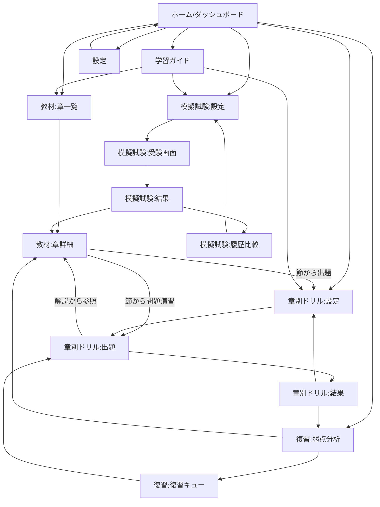

# フェーズ0：調査・設計資料

作成日: 2026-08-01
対象: G検定学習・演習アプリ スクラッチ開発
ステータス: 承認待ち（フェーズ1未着手）

---

## 1. 確認したファイル一覧

| ファイル | 内容 | 備考 |
|---|---|---|
| `CLAUDE.md` | 教材優先順位、必須ルール、問題データ推奨項目 | 本設計の制約条件の正本 |
| `README.md` | リポジトリ概要、開発原則、推奨ディレクトリ | `materials/questions/scripts/docs/src/public` を推奨 |
| `FILE_MANIFEST.txt` | リポジトリ内ファイル一覧 | `docs/.gitkeep` `questions/.gitkeep` `scripts/.gitkeep` `src/.gitkeep` が既に存在 |
| `materials/INDEX.md` | 章別ファイルの読み込み順、正規データの扱い方針 | 章別Markdownを優先せよと明記 |
| `materials/chapters/00〜15` の全17ファイル | 表紙・はじめに・学習マップ・推奨学習順・第1〜10章・付録A/B | 全ファイルの見出し構造(`#`〜`####`)を全件抽出して確認 |
| `materials/G検定_学習テキスト_Rev0.md` | 全文版（3557行） | 見出し構造を章別Markdownと突き合わせ、第1〜5章の範囲でスポットチェックし、章立て・節見出しの文言が完全一致することを確認（相違なし） |

第1章 (`04_第1章.md`, 228行) は内容を全文精読済み。他章は見出し構造（節タイトル・サブ構成）を全件確認済みで、本文全文は未精読（フェーズ1で該当章に着手する際に精読する）。

---

## 2. 教材の章・節構造

### 全体構成

```
表紙・概要 / はじめに（学習の6段階） / 学習マップ / 推奨学習順
├ 第1章 人工知能とは                        （5節）
├ 第2章 人工知能をめぐる動向                （6節）
├ 第3章 機械学習の概要                      （8節）
├ 第4章 ディープラーニングの概要            （4.1〜4.7 = 7節）
├ 第5章 ディープラーニングの要素技術        （5.1〜5.12 = 12節）
├ 第6章 ディープラーニングの応用例          （6.1〜6.7 = 7節）
├ 第7章 AIの社会実装に向けて                （7.1〜7.6 = 6節）
├ 第8章 AIに必要な数理・統計知識            （8.1〜8.5 = 5節）
├ 第9章 AIに関する法律と契約                （9.1〜9.7 = 7節）
├ 第10章 AI倫理・AIガバナンス               （10.1〜10.8 = 8節）
├ 付録A 理解確認チェック120（項目チェックリスト、章横断）
└ 付録B 試験当日の戦い方（5項目 + AI活用時の注意）
```

節番号は第1〜3章が章内独立採番（「1.」「2.」…）、第4〜10章は「4.1」のように章番号付きで採番されており、書式が統一されていない。アプリ側では両方とも `sectionId = ch{章番号2桁}-s{節連番2桁}` に正規化し、`sourceHeading` に原文の見出し文字列をそのまま保持することで、表記ゆれを吸収しつつ原文参照性を保つ。

### 各章に共通する内部構造（第1〜10章で共通）

1. `## この章で学ぶこと`（章冒頭の到達目標リスト）
2. 各節：
   - `### まずイメージ` または `### 要点と使い分け`（どちらか一方。直感的な導入か、対比中心の簡潔整理かで教材側が使い分けている）
   - `### 仕組みと背景`（深掘り説明。全節に存在するわけではない）
   - `#### この節のポイント`（箇条書きの要約。全節に存在）
3. `## 次章へのつながり`
4. `## 章末整理：〜`
   - `### この章の理解マップ`
   - `### 本文を補う用語`（本文にない補足用語。重要度ラベル A/B/C 相当の記法あり）
   - `### 重要な区別`（比較表）
   - `### 確認ポイント`

この構造は10章すべてで一貫しており、コンテンツパーサーの単一実装で全章に対応できる。付録A（120項目のチェックリスト）と付録B（試験当日の戦い方）は章別ドリルの節構造とは別の「横断リソース」として扱う。

### 教材と全文版の整合性

第1〜5章の範囲で見出し一覧を突き合わせた結果、`materials/chapters/*.md` と `G検定_学習テキスト_Rev0.md` の章タイトル・節タイトルは完全一致しており、現時点で相違は検出されていない。CLAUDE.mdの指示に従い、全章の本文レベルの突き合わせはフェーズ1で各章に着手する際に実施し、相違があれば実装を進めず報告する。

---

## 3. 推奨技術構成

指定技術（React / TypeScript / Vite / PWA / IndexedDB / Vitest / Playwright）を採用する。いずれも代案の方が明確に優れているとは判断しなかったため、追加の選定のみ提案する。

| 領域 | 選定 | 理由 |
|---|---|---|
| ルーティング | React Router | 画面数が多く（ダッシュボード／教材／ドリル／復習／模試／ガイド／設定）、ネスト・パラメータ付きルート（章ID・節ID）が必要 |
| 状態管理 | Zustand + IndexedDB永続化層 | Reduxほどの定型コードを要さず、React Contextより大域状態（進捗・設定）の更新頻度に強い。学習ロジックはストアと分離した純粋関数として実装しテスト容易性を確保 |
| IndexedDBアクセス | `idb`（軽量ラッパー） | Promiseベースで型付けしやすく、将来のクラウド同期層への差し替えを想定した抽象化がしやすい |
| スタイリング | CSS Modules + デザイントークン(CSS変数) | 「装飾過多を避け、社会人が長時間使える落ち着いたデザイン」という要件に対し、ユーティリティクラスの乱立より一貫したトークン管理の方が保守しやすいと判断。Tailwind等のCSSフレームワークは可読性とのトレードオフがあるため今回は採用しない（要望があれば変更可） |
| Markdown処理 | ビルド時変換（remark/unified）＋実行時は構造化JSONを描画 | 教材Markdownをブラウザで都度パースせず、`scripts/build-content.ts` で章・節・ブロック単位のJSONに変換してから配信する。理由は (a) 教材とアプリの分離をより明確にできる (b) 見出し単位ジャンプや「この節のポイント」等の構造化表示がしやすい (c) 教材改訂時に生成物との差分で影響範囲を検出できる |
| PWA | `vite-plugin-pwa` | Service Worker生成・マニフェスト管理を標準化し、オフラインキャッシュ戦略（教材JSON・問題JSON・アプリシェル）を設定ベースで管理できる |
| フォーム/入力 | ネイティブHTML+最小限のカスタムフック | 依存を増やさず、キーボード操作要件（4択への数字/矢印キー割当）を独自実装で満たす |
| テスト | Vitest（ユニット：SRSロジック、採点、品質検査スクリプト）／Playwright（E2E：ドリル一周、模試一周、PWAインストール導線） | 指定通り |
| Lint/Format | ESLint + Prettier | 明記はないが型安全と一貫性のため推奨（承認事項） |

---

## 4. 画面一覧

| # | 画面 | 主な内容 |
|---|---|---|
| 1 | ホーム / ダッシュボード | 総合進捗、章別進捗、難易度別正答率、弱点（章・節・タグ）、未復習件数、直近学習履歴、模試得点推移、学習時間、今日の推奨アクション |
| 2 | 教材：章一覧 | 全10章、章番号順⇄推奨学習順の切替、章別学習済み率 |
| 3 | 教材：章詳細（本文ビューア） | 見出し単位ナビゲーション、まずイメージ/要点と使い分け・仕組みと背景・この節のポイントの表示、章末整理（用語・重要な区別・確認ポイント）、既読状態の記録 |
| 4 | 章別ドリル：設定 | 章・節・タグ・難易度（基礎/標準/応用）・出題範囲（未回答/誤答/未習得/ブックマーク）・出題数・ランダム化有無の指定 |
| 5 | 章別ドリル：出題 | 4択問題、キーボード操作、回答後に正誤＋正解/誤答理由＋参照章節へのリンクを表示 |
| 6 | 章別ドリル：結果サマリー | 今回の正答率、間違えた問題一覧、復習登録状況 |
| 7 | 復習：弱点分析 | 苦手章・節・タグの一覧、誤答→再習得までの履歴 |
| 8 | 復習：復習キュー | 間隔反復スケジュールに基づく推奨復習順、ブックマーク一覧 |
| 9 | 復習：出題 | 画面4/5と共通コンポーネントを再利用 |
| 10 | 模擬試験：設定 | 問題数・制限時間の選択 |
| 11 | 模擬試験：受験画面 | タイマー、問題一覧からのジャンプ、後で確認フラグ、正誤非表示 |
| 12 | 模擬試験：結果 | 総合点、章別/難易度別/タグ別成績、正答・誤答・未回答一覧 |
| 13 | 模擬試験：履歴比較 | 過去の受験結果一覧と得点推移グラフ |
| 14 | 学習ガイド | 学習の6段階、1〜3周目・直前期の使い方、現在地に応じた次の一手の提案、試験当日の戦い方（付録B） |
| 15 | 設定 | ライト/ダークモード、データのエクスポート/インポート、学習履歴初期化（確認ダイアログ必須） |
| 16（将来） | ログイン/組織/管理者機能のプレースホルダー | 初期版では非表示。ルーティングと状態層に拡張余地のみ確保 |

---

## 5. 画面遷移



すべての画面は共通ヘッダー（ホーム/教材/ドリル/復習/模試/ガイド/設定へのグローバルナビ）からも直接遷移可能とする。ドリル出題中に閉じた場合は再開用の状態をIndexedDBに保存し、次回起動時に「続きから再開しますか」を提示する。

---

## 6. データスキーマ案

### 6.1 コンテンツ側（教材由来・ビルド生成物、`content/`）

```ts
interface Chapter {
  chapterId: string;        // "ch01"
  number: number;           // 1
  title: string;            // "人工知能とは"
  sourceFile: string;       // "materials/chapters/04_第1章.md"
  contentHash: string;      // 教材ファイルのハッシュ（改訂検知用）
  recommendedOrderIndex: number; // 推奨学習順での位置
  learningGoals: string[];  // 「この章で学ぶこと」
  sections: Section[];
  transitionNote: string;   // 「次章へのつながり」
  summary: ChapterSummary;
}

interface Section {
  sectionId: string;        // "ch01-s01"
  index: number;
  title: string;            // 原文見出し "1. 人工知能の定義とその多様性"
  introType: "image" | "concise"; // まずイメージ / 要点と使い分け
  introText: string;
  mechanismText?: string;   // 仕組みと背景（存在する節のみ）
  keyPoints: string[];      // この節のポイント
}

interface ChapterSummary {
  conceptMap: string;
  supplementaryTerms: { term: string; importance: "A" | "B" | "C"; description: string }[];
  keyDistinctions: { item: string; criterion: string }[];
  checkpoints: string[];
}
```

`content/manifest.json` に全章・全節のID一覧とハッシュを持たせ、問題データの `sourceReference` が実在する章・節を指しているかを検証する際の基準にする。

### 6.2 問題データ（`questions/`、CLAUDE.md記載項目を採用）

```ts
type Difficulty = "basic" | "standard" | "advanced";

interface Question {
  id: string;                 // "ch01-basic-001"
  chapterId: string;          // "ch01"
  sectionId: string;          // "ch01-s01"
  difficulty: Difficulty;
  question: string;
  choices: string[];          // 4件固定
  correctAnswer: number;      // 0-3
  explanation: string;        // 正解の解説
  choiceExplanations: string[]; // 各選択肢が正/誤である理由（4件、choicesと同数）
  tags: string[];             // 例: ["定義", "AI効果", "強いAI弱いAI"]
  sourceFile: string;         // "materials/chapters/04_第1章.md"
  sourceHeading: string;      // 原文見出し
  sourceReference: string;    // "第1章 4節" 等、人間可読の参照
  contentVersion: string;     // 対応するcontentHashまたは教材確認基準日
  asOfDate?: string;          // 法律・制度・生成AI等、時点依存の場合の確認基準日
  createdAt: string;
  reviewStatus: "draft" | "reviewed"; // 品質確認フローの状態
}
```

### 6.3 学習履歴・進捗（IndexedDB、`src/shared/lib/db`）

```ts
interface QuestionProgress {
  questionId: string;         // 主キー
  attempts: number;
  correctCount: number;
  correctStreak: number;
  lastAnsweredAt: string | null;
  lastResult: "correct" | "incorrect" | null;
  bookmarked: boolean;
  srsBox: number;             // 1-5（Leitner方式）
  nextReviewAt: string | null;
  history: { answeredAt: string; result: "correct" | "incorrect"; selectedIndex: number }[];
}

interface StudySessionLog {
  sessionId: string;
  type: "drill" | "review" | "mock_exam" | "material_reading";
  startedAt: string;
  endedAt: string | null;
  chapterIds: string[];
  questionIds: string[];
  scoreSummary?: { correct: number; total: number };
}

interface MockExamResult {
  examId: string;
  takenAt: string;
  durationSec: number;
  questionCount: number;
  answers: { questionId: string; selectedIndex: number | null; flaggedForReview: boolean }[];
  totalScore: number;
  byChapter: Record<string, { correct: number; total: number }>;
  byDifficulty: Record<Difficulty, { correct: number; total: number }>;
  byTag: Record<string, { correct: number; total: number }>;
}

interface MaterialReadState {
  sectionId: string;
  readAt: string | null;
}

interface UserSettings {
  theme: "light" | "dark" | "system";
  keyboardShortcutsEnabled: boolean;
}
```

IndexedDBストア構成: `questionProgress` / `studySessionLog` / `mockExamResults` / `materialReadState` / `userSettings`（いずれもキー: 各interfaceの主キー相当）。エクスポート/インポートはこれら全ストアをまとめた単一JSONで行う。

---

## 7. ディレクトリ構成案

```
G-Kentei/
├── materials/                 # 正本教材（既存・編集不可）
├── content/                   # materialsからビルド生成する構造化JSON（生成物。git管理し差分を可視化）
│   ├── manifest.json
│   └── chapters/ch01.json ...
├── questions/                 # 問題データ（レビュー対象）
│   ├── ch01/basic.json, standard.json, advanced.json
│   └── schema/question.schema.json
├── scripts/
│   ├── build-content.ts       # materials/*.md → content/*.json
│   ├── validate-questions.ts  # 問題データ品質検査
│   └── coverage-report.ts     # 章・節×問題の対応表生成
├── src/
│   ├── app/                   # ルーティング・レイアウト・グローバルナビ
│   ├── features/
│   │   ├── dashboard/
│   │   ├── materials-viewer/
│   │   ├── drill/
│   │   ├── review/
│   │   ├── mock-exam/
│   │   └── guide/
│   ├── entities/               # Question, Chapter, Progress等のドメイン型・純粋ロジック
│   ├── shared/
│   │   ├── ui/                 # 汎用UIコンポーネント（ボタン、カード等）
│   │   ├── lib/                # idbラッパー、SRSロジック、採点ロジック
│   │   └── hooks/
│   ├── styles/                 # デザイントークン、グローバルCSS
│   └── main.tsx
├── public/
│   ├── icons/
│   └── manifest.webmanifest
├── tests/
│   ├── unit/
│   └── e2e/
├── docs/
│   ├── phase0-design.md        # 本ファイル
│   ├── content-mapping.md      # 章節×問題の対応表（自動生成）
│   └── material-discrepancies.md # 章別Md/全文版の相違報告用（発生時のみ）
├── package.json / vite.config.ts / tsconfig.json / vitest.config.ts / playwright.config.ts
```

---

## 8. 問題生成と品質検査の方法

### 生成フロー
1. 対象章の章別Markdownを精読し、節ごとに出題候補を洗い出す（暗記／比較／関係性／適用判断の観点で分類）。
2. `questions/ch{NN}/{difficulty}.json` にドラフトを作成（`reviewStatus: "draft"`）。
3. 各問題に `sourceHeading` / `sourceReference` / `contentVersion` を付与。
4. `scripts/validate-questions.ts` を実行し、自動検査に通過させる。
5. 人間（ユーザー）がレビューし、承認後 `reviewStatus: "reviewed"` に更新。

### 自動検査項目（`validate-questions.ts`）
- 問題ID重複チェック
- 必須項目欠落チェック（CLAUDE.md記載の全項目）
- 選択肢数が4件であること
- `correctAnswer` が0-3の範囲内であること
- `explanation` および `choiceExplanations` の各要素が空でないこと
- `sourceReference` が空でないこと、かつ `chapterId`/`sectionId` が `content/manifest.json` に実在すること
- 重複・類似問題の検出（正規化した問題文＋選択肢集合のJaccard類似度が閾値超のペアを警告）
- 難易度別・章別の問題数分布の偏り検出（設定した目標数からの乖離を警告、エラーにはしない）

検査結果は `docs/content-mapping.md`（章・節ごとの問題数一覧）として出力し、次章への展開時に「どの節がまだカバーされていないか」を確認できるようにする。

---

## 9. フェーズ別実装計画

指示済みのフェーズ0〜4に沿う。**今回はフェーズ0のみを実施し、以降はユーザー承認後に着手する。**

| フェーズ | 主な成果物 |
|---|---|
| 0（今回） | 本設計資料一式 |
| 1 | プロジェクト雛形、ホーム画面（簡易版）、第1章の教材表示、第1章25問（基礎10/標準10/応用5）のドリル、正誤判定・解説表示、IndexedDB保存、簡易進捗表示、ライト/ダークモード、単体テスト |
| 2 | 全章の教材データ・問題データ展開、復習機能（SRS）、苦手分析、学習ガイド、教材参照リンク、データ入出力、品質検査スクリプトの本格運用 |
| 3 | 模擬試験機能、成績分析、履歴比較、得点推移、E2Eテスト |
| 4 | オフライン対応、PWAインストール、パフォーマンス改善、アクセシビリティ確認、リリース手順・運用文書 |

フェーズ1着手時は、まず第1章のみでスキーマ・UI・品質を確認し、承認を得てからフェーズ2で全章展開する（CLAUDE.mdの指示通り）。

---

## 10. 想定されるリスク

1. **教材からの逸脱（ハルシネーション）リスク**：問題・解説作成時にAIが教材にない知識を補ってしまう可能性。対策として全問題に `sourceHeading`／原文引用可能な `sourceReference` を必須化し、レビュー時に本文と突き合わせる運用とする。
2. **章別Markdownと全文版の未検証範囲**：見出し構造は第1〜5章周辺で一致を確認したが、全章・本文レベルの突き合わせは未実施。フェーズ1以降、着手章ごとに逐次確認し、相違があれば `docs/material-discrepancies.md` に報告して実装を止める。
3. **問題の水増し・類似問題によるドリル効果の低下**：表現を変えただけの類問が増えるリスク。類似度チェックをCIレベルで運用し検出する。
4. **IndexedDBの利用制約**：プライベートブラウジングやストレージ制限のあるブラウザでは保存が失敗しうる。保存失敗時のユーザー通知とメモリ内フォールバックの設計が必要（フェーズ1で最小限、フェーズ4で強化）。
5. **教材改訂と問題データの追従漏れ**：`content/` のハッシュ管理により検知は可能だが、検知後の再レビューは人手に依存する。運用ルールをdocsに明文化する必要がある。
6. **模擬試験の出題比率の妥当性**：シラバス上の配点比率が教材内に明記されているか未確認。明記がない場合、章別問題数比率で代替するか、別途ユーザーに基準比率を確認する必要がある（下記11-3参照）。
7. **スコープの大きさ**：全10章・模擬試験・PWA・復習分析まで含めると実装量が大きい。フェーズを厳格に区切り、各フェーズ終了時に動作確認・承認を挟むことでリスクを分散する。
8. **時点依存情報（法律・生成AI等）の陳腐化**：問題データに `asOfDate` を必須化し、ダッシュボードや解説表示に確認基準日を明示することで対応する。

---

## 11. 私が承認すべき判断事項

1. **技術選定の詳細**：状態管理にZustand、スタイリングにCSS Modules（Tailwind不採用）、MarkdownはビルドタイムJSON変換方式とする案でよいか。
2. **`content/`（教材からの生成物）をgit管理するか**：改訂差分を可視化するためコミット対象とする案を提案しているが、ビルド時生成のみ（gitignore）でよいか。
3. **模擬試験の出題比率の根拠**：教材内にシラバス配点比率の明記がないため、章別均等割り／問題数比率／ユーザー指定比率のいずれを初期値とするか。
4. **SRS（間隔反復）アルゴリズムの方式**：シンプルなLeitner方式（5段階の固定間隔）を初期実装とする案でよいか、それともSM-2相当のより精緻なアルゴリズムを最初から求めるか。
5. **付録A「理解確認チェック120」の扱い**：この120項目をタグ体系のベース（または横断的なチェックリスト画面）として正式に組み込むか。
6. **第1章25問の内容レビュー体制**：フェーズ1でドラフトを作成した後、画面実装前に問題文面のレビューを挟むか、画面実装まで進めてからまとめてレビューするか。
7. **ESLint/Prettier等、指示にない補助ツールの追加可否**。
8. **章別Markdownと全文版の全章突き合わせ**を、フェーズ1着手前に一括で行うか、各章着手のタイミングで都度行うか。

以上がフェーズ0の調査・設計内容です。ご承認いただき次第、フェーズ1（第1章のみの最小実用版）に着手します。
