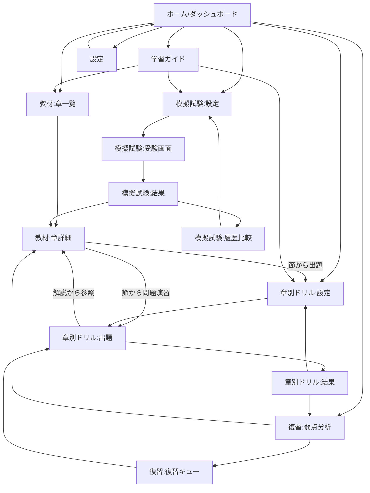

# フェーズ0：調査・設計資料（確定版）

作成日: 2026-08-01（初版）／改訂: 2026-08-01（承認内容反映版・第1章25問承認版）
対象: G検定学習・演習アプリ スクラッチ開発
ステータス: 技術方針・データ方針、および第1章25問（`reviewStatus: approved`）は承認済み。フェーズ2以降は、章ごとにレビュー用一覧を生成しユーザー承認を得てから次章へ進む（本書10節・11節参照）。

このドキュメントは初版に対するユーザー承認（技術選定、Git管理方針、模擬試験出題比率、SRSアルゴリズム、タグ体系、レビュー体制、開発ツール、教材突き合わせ方式）を反映した確定版である。教材と全文版の全章突き合わせ結果は `docs/material-comparison-report.md` を参照。

---

## 1. 確認したファイル一覧

| ファイル                                   | 内容                                                       | 備考                                                                                                                                               |
| ------------------------------------------ | ---------------------------------------------------------- | -------------------------------------------------------------------------------------------------------------------------------------------------- |
| `CLAUDE.md`                                | 教材優先順位、必須ルール、問題データ推奨項目               | 本設計の制約条件の正本                                                                                                                             |
| `README.md`                                | リポジトリ概要、開発原則、推奨ディレクトリ                 | `materials/questions/scripts/docs/src/public` を推奨                                                                                               |
| `FILE_MANIFEST.txt`                        | リポジトリ内ファイル一覧                                   |                                                                                                                                                    |
| `materials/INDEX.md`                       | 章別ファイルの読み込み順、正規データの扱い方針             | 章別Markdownを優先せよと明記                                                                                                                       |
| `materials/chapters/00〜15` の全16ファイル | 表紙・はじめに・学習マップ・推奨学習順・第1〜10章・付録A/B | 全ファイルの見出し構造を全件抽出し、さらに全文版との内容突き合わせをプログラムで実施（結果は本書2.3節および `docs/material-comparison-report.md`） |
| `materials/G検定_学習テキスト_Rev0.md`     | 全文版（3557行）                                           | 章別Markdown16ファイルとの完全一致を機械的に確認済み                                                                                               |

第1章 (`04_第1章.md`, 228行) は内容を全文精読済み。他章は見出し構造（節タイトル・サブ構成）を全件確認済み。

---

## 2. 教材の章・節構造

### 2.1 全体構成

```
表紙・概要 / はじめに（学習の6段階） / 学習マップ / 推奨学習順
├ 第1章 人工知能とは                        （5節）
├ 第2章 人工知能をめぐる動向                （6節）
├ 第3章 機械学習の概要                      （8節）
├ 第4章 ディープラーニングの概要            （4.1〜4.7 = 7節）
├ 第5章 ディープラーニングの要素技術        （5.1〜5.12 = 12節）
├ 第6章 ディープラーニングの応用例          （6.1〜6.7 = 7節）
├ 第7章 AIの社会実装に向けて                （7.1〜7.6 = 6節）
├ 第8章 AIに必要な数理・統計知識            （8.1〜8.5 = 5節）
├ 第9章 AIに関する法律と契約                （9.1〜9.7 = 7節）
├ 第10章 AI倫理・AIガバナンス               （10.1〜10.8 = 8節）
├ 付録A 理解確認チェック120（項目チェックリスト、章横断、全120項目を件数確認済み）
└ 付録B 試験当日の戦い方（5項目 + AI活用時の注意）
```

節番号は第1〜3章が章内独立採番、第4〜10章は章番号付きで採番されており書式が統一されていない。アプリ側では `sectionId = ch{章番号2桁}-s{節連番2桁}` に正規化し、`sourceHeading` に原文の見出し文字列をそのまま保持する。

### 2.2 各章に共通する内部構造（第1〜10章で共通）

1. `## この章で学ぶこと`（章冒頭の到達目標リスト）
2. 各節：
   - `### まずイメージ` または `### 要点と使い分け`（どちらか一方）
   - `### 仕組みと背景`（深掘り説明。全節に存在するわけではない）
   - `#### この節のポイント`（箇条書きの要約。全節に存在）
3. `## 次章へのつながり`
4. `## 章末整理：〜`
   - `### この章の理解マップ`
   - `### 本文を補う用語`（本文にない補足用語。重要度ラベル A/B/C 相当の記法あり）
   - `### 重要な区別`（比較表）
   - `### 確認ポイント`

この構造は10章すべてで一貫しており、コンテンツパーサーの単一実装で全章に対応できる。

### 2.3 章別Markdownと全文版の突き合わせ結果（確定）

`scripts/compare-materials.mjs` により全16ファイルを機械的に突き合わせた結果、**本文差分ゼロ・見出し不一致ゼロ**を確認した。全文版は章別Markdown16ファイルを空行1行区切りで単純連結したものであり、両者は構造的に同一である。文字化け（Unicode置換文字）も検出されなかった。詳細は `docs/material-comparison-report.md` を参照。

この結果を踏まえ、**章別Markdown（`materials/chapters/`）をアプリのコンテンツ生成・問題作成における唯一の正本とする**。全文版は通読・横断検索用の参照ファイルとして維持し、ビルドパイプラインの入力対象にはしない。

教材が将来改訂された場合は `node scripts/compare-materials.mjs <対象番号>` で対象章のみ再検証し、`docs/material-comparison-report.md` に追記する運用とする。

---

## 3. 技術構成（確定）

| 領域           | 選定                                                                                              |
| -------------- | ------------------------------------------------------------------------------------------------- |
| フレームワーク | React + TypeScript（`strict: true`）                                                              |
| ビルド         | Vite                                                                                              |
| ルーティング   | React Router                                                                                      |
| 状態管理       | 後述3.1参照。すべてをZustandに集約しない                                                          |
| 永続化         | IndexedDB（`idb`ラッパー）                                                                        |
| スタイリング   | CSS Modules + CSS Custom Propertiesによるデザイントークン。UIフレームワークは初期版では導入しない |
| Markdown処理   | ビルド時変換（後述3.2参照）。実行時にMarkdownを直接パースしない                                   |
| スキーマ検証   | Zod（コンテンツJSON・問題データ双方の検証に使用）                                                 |
| PWA            | `vite-plugin-pwa`（導入自体はフェーズ4）                                                          |
| テスト         | Vitest（ユニット）／Playwright（E2E）                                                             |
| 静的解析・整形 | ESLint（コード品質）／Prettier（書式整形）／EditorConfig／TypeScript strict（後述7参照）          |

### 3.1 状態管理の役割分担

| 状態の種類                                 | 保存場所            | 例                                                                                                                                              |
| ------------------------------------------ | ------------------- | ----------------------------------------------------------------------------------------------------------------------------------------------- |
| 画面内だけで完結する一時的な状態           | `useState`（React） | 入力中の値、モーダル開閉、選択中の選択肢のハイライト                                                                                            |
| 複数画面で共有するが揮発性でよい学習状態   | Zustand             | 現在のドリル/模試セッションの出題キューと進行位置、直近の正誤フィードバック表示、ダッシュボード表示用の集計キャッシュ、テーマ設定のメモリ上の値 |
| 永続化が必要な学習履歴・模試履歴・復習情報 | IndexedDB           | `QuestionProgress` / `StudySessionLog` / `MockExamResult` / `MaterialReadState` / `UserSettings`                                                |

Zustandストアは永続化の主体にはしない。IndexedDBへの読み書きは `shared/lib/db` 層が担い、Zustandストアはその結果をメモリにキャッシュしてUIに配る役割に限定する（ストア初期化時にIndexedDBから読み込み、更新時は非同期でIndexedDBに書き込みつつストアも更新する、という一方向のデータフローとする）。

### 3.2 教材ビルドパイプライン（確定）

```
materials/chapters/*.md（正本）
   → scripts/build-content.ts（remark/unifiedでASTを走査し、章・節・ブロック単位に構造化）
   → Zodスキーマで構造を検証（見出し欠落や想定外の構造を検出）
   → content/chapters/ch{NN}.json + content/manifest.json を出力
   → アプリはこのJSONのみを読み込む（Markdownを実行時に解析しない）
```

生成JSONには元のMarkdownファイル名（`sourceFile`）、章ID、節ID、原文見出し（`sourceHeading`）を保持する。変換処理はスクリプトとして管理し、生成後のJSONを手作業で修正することは禁止する（修正が必要な場合はスクリプトまたは教材側を直す）。

---

## 4. Git管理方針（確定）

### Git管理するもの

- `materials/` 配下の教材Markdown原本
- `questions/` 配下の問題データ原本
- `content/` 配下の生成済み教材JSON（**確定済みのものに限り、初期段階ではGit管理する**）
- Zod等のスキーマ定義ファイル
- `scripts/` のMarkdown→JSON変換スクリプト、問題データ検証スクリプト
- アプリのソースコード（`src/`）
- 設定ファイル（`package.json`, `vite.config.ts`, `tsconfig.json` 等）
- テストコード（`tests/`）
- 公開に必要な固定データ（アイコン等）

### 原則としてGit管理しないもの

- `dist/`
- テストレポート
- Playwrightのスクリーンショット・動画
- 一時キャッシュ
- 開発中のログ
- `node_modules/`

### 生成JSON（`content/`）の扱い

初期段階ではGit管理し、生成結果の差分もレビュー対象とする（Claude Code on the web、GitHub Pages、CI等での再現性確保のため）。各生成JSONファイルの先頭には次のような注記を入れ、直接編集を禁止する。

```json
{
  "_generated": true,
  "_generatedBy": "scripts/build-content.ts",
  "_doNotEdit": "このファイルは自動生成物です。修正は materials/ または scripts/build-content.ts に対して行ってください。",
  ...
}
```

CIが安定した段階で、`content/` をGit管理対象から外すか改めて判断する。

---

## 5. 画面一覧

| #          | 画面                                       | 主な内容                                                                                                                         |
| ---------- | ------------------------------------------ | -------------------------------------------------------------------------------------------------------------------------------- |
| 1          | ホーム / ダッシュボード                    | 総合進捗、章別進捗、難易度別正答率、弱点（章・節・タグ）、未復習件数、直近学習履歴、模試得点推移、学習時間、今日の推奨アクション |
| 2          | 教材：章一覧                               | 全10章、章番号順⇄推奨学習順の切替、章別学習済み率                                                                                |
| 3          | 教材：章詳細（本文ビューア）               | 見出し単位ナビゲーション、まずイメージ/要点と使い分け・仕組みと背景・この節のポイントの表示、章末整理、既読状態の記録            |
| 4          | 章別ドリル：設定                           | 章・節・タグ・難易度（基礎/標準/応用）・出題範囲（未回答/誤答/未習得/ブックマーク）・出題数・ランダム化有無の指定                |
| 5          | 章別ドリル：出題                           | 4択問題、キーボード操作、回答後に正誤＋正解/誤答理由＋参照章節へのリンクを表示                                                   |
| 6          | 章別ドリル：結果サマリー                   | 今回の正答率、間違えた問題一覧、復習登録状況                                                                                     |
| 7          | 復習：弱点分析                             | 苦手章・節・タグの一覧、誤答→再習得までの履歴                                                                                    |
| 8          | 復習：復習キュー                           | SRSスケジュールに基づく推奨復習順、ブックマーク一覧                                                                              |
| 9          | 復習：出題                                 | 画面4/5と共通コンポーネントを再利用                                                                                              |
| 10         | 模擬試験：設定                             | 問題数・制限時間の選択                                                                                                           |
| 11         | 模擬試験：受験画面                         | タイマー、問題一覧からのジャンプ、後で確認フラグ、正誤非表示                                                                     |
| 12         | 模擬試験：結果                             | 総合点、章別/難易度別/タグ別成績、正答・誤答・未回答一覧、出題比率が「教材ベース配分」である旨の明記                             |
| 13         | 模擬試験：履歴比較                         | 過去の受験結果一覧と得点推移グラフ                                                                                               |
| 14         | 学習ガイド                                 | 学習の6段階、1〜3周目・直前期の使い方、現在地に応じた次の一手の提案、試験当日の戦い方（付録B）                                   |
| 15         | 設定                                       | ライト/ダークモード、データのエクスポート/インポート、学習履歴初期化（確認ダイアログ必須）                                       |
| 16（将来） | ログイン/組織/管理者機能のプレースホルダー | 初期版では非表示                                                                                                                 |

---

## 6. 画面遷移



ドリル出題中に閉じた場合は再開用の状態をIndexedDBに保存し、次回起動時に「続きから再開しますか」を提示する。

---

## 7. 開発ツール構成（確定）

| ツール       | 役割                                                                                       |
| ------------ | ------------------------------------------------------------------------------------------ |
| ESLint       | コード品質（未使用変数、React/TypeScriptのベストプラクティス違反等）                       |
| Prettier     | 書式整形のみ（`eslint-config-prettier`でESLintの書式系ルールを無効化し、二重管理を避ける） |
| TypeScript   | `strict: true` を含む厳格設定                                                              |
| EditorConfig | 改行コード・インデント・文字コードの統一                                                   |

npm scripts:

```
npm run lint          # ESLint実行
npm run format         # Prettierで整形（書き込み）
npm run format:check   # Prettierの整形チェックのみ（CI用）
npm run typecheck      # tsc --noEmit
npm run test           # Vitest（unit）
npm run build          # vite build
```

CI（GitHub Actions）で `lint` → `typecheck` → `test`（unit） → 問題データ検証（`validate-questions`） → `build` を実行する。HuskyやElint-staged等のGitフック系ツールは現時点では導入しない（npm scripts + CIを優先）。

---

## 8. データスキーマ（確定）

### 8.1 コンテンツ側（教材由来・ビルド生成物、`content/`）

```ts
interface Chapter {
  chapterId: string; // "ch01"
  number: number;
  title: string;
  sourceFile: string; // "materials/chapters/04_第1章.md"
  contentHash: string; // 教材ファイルのハッシュ（改訂検知用）
  recommendedOrderIndex: number;
  learningGoals: string[];
  sections: Section[];
  transitionNote: string;
  summary: ChapterSummary;
}

interface Section {
  sectionId: string; // "ch01-s01"
  index: number;
  title: string; // 原文見出し
  introType: "image" | "concise";
  introText: string;
  mechanismText?: string;
  keyPoints: string[];
}

interface ChapterSummary {
  conceptMap: string;
  supplementaryTerms: { term: string; importance: "A" | "B" | "C"; description: string }[];
  keyDistinctions: { item: string; criterion: string }[];
  checkpoints: string[];
}
```

### 8.2 タグ体系（確定方針・改訂版）

第1章25問の初回レビュー（フェーズ1）を踏まえ、`tags` は章・節・個別概念という3階層の分類軸に加えて、**表示用タグと内部管理用タグを区別する**ため、次の3種類のオブジェクトとして構成する（`chapterId`/`sectionId` は既存の別フィールドで章・節を構造化しているため、`tags` 自体に章タグを重複させない）。

1. **`contentTags`（表示用・個別概念タグ）**：例 `AI効果`, `チューリングテスト`, `中国語の部屋`。学習者向けUI（教材参照リンクや弱点タグ表示等）で将来表示しうるタグ。
2. **`skillTags`（内部管理用・出題意図タグ）**：`暗記` / `比較` / `関係性` / `適用判断` の4種類の固定語彙（CLAUDE.mdの「暗記だけでなく、比較、関係性、適用判断を問う」という方針に対応）。著者・レビューが出題意図の偏りを点検するための内部タグで、学習者向けUIには表示しない。1問に複数の`skillTags`を付与できるため、`skillTags`別に問題数を集計・表示する場合（レビュー用一覧、将来の管理画面等）は、件数合計が問題総数を超えうる旨を必ず注記すること。
3. **`crossChapterTags`（内部管理用・章横断タグ）**：例 `第2章:フレーム問題への伏線`。複数章にまたがる概念や、他章との接続を示す注記。著者・レビュー用の内部タグ。

付録A「理解確認チェック120」は `contentTags` の**候補の主要な出発点**として使用するが、そのまま唯一の正式タグ体系にはしない。全章の問題作成が進む過程で、以下の観点をチェックしたうえで正式な `contentTags` 一覧（`content/tags.json` 等）を確定する。

- 同義語の重複（例: 表記ゆれの統合）
- 粒度のばらつき（一部の項目が他より粗い/細かい）
- 複数章にまたがる概念（`crossChapterTags` として扱うか、代表章の `contentTags` とするか）
- 単独タグとして細かすぎる項目（上位テーマタグへ統合するか判断）
- 章・節の分類と一致しない項目

付録Aの原文自体は変更しない。タグ一覧の確定はフェーズ2（全章展開時）に行い、フェーズ1では第1章の範囲でのみ `contentTags` を暫定的に付与する。

### 8.3 問題データ（`questions/`）

第1章25問の初回レビューを踏まえ、`reviewStatus` は `draft`（ドラフト・レビュー待ち）／`approved`（承認済み）／`needs_revision`（要修正）の3値で管理する。

```ts
type Difficulty = "basic" | "standard" | "advanced";
type SkillTag = "暗記" | "比較" | "関係性" | "適用判断";

interface QuestionTags {
  contentTags: string[]; // 表示用・個別概念タグ（1件以上）
  skillTags: SkillTag[]; // 内部管理用・出題意図タグ（1件以上）
  crossChapterTags: string[]; // 内部管理用・章横断タグ（0件以上）
}

interface Question {
  id: string; // "ch01-basic-001"
  chapterId: string; // "ch01"
  sectionId: string; // "ch01-s01"
  difficulty: Difficulty;
  question: string;
  choices: string[]; // 4件固定
  correctAnswer: number; // 0-3
  explanation: string;
  choiceExplanations: string[]; // 4件、choicesと同数
  tags: QuestionTags;
  sourceFile: string;
  sourceHeading: string;
  sourceReference: string;
  contentVersion: string;
  asOfDate?: string; // 時点依存情報がある場合の確認基準日
  createdAt: string;
  reviewStatus: "draft" | "approved" | "needs_revision";
}
```

### 8.4 SRS（間隔反復）データと状態遷移（確定）

学習状態は次の4状態を持つ。

- `not_started`（未学習）
- `learning`（学習中）
- `due_for_review`（要復習）
- `mastered`（習得済み）

復習段階（`srsStage`）は0〜4の5段階固定間隔とする。

| 段階 | 復習間隔       |
| ---- | -------------- |
| 0    | 当日または翌日 |
| 1    | 3日後          |
| 2    | 7日後          |
| 3    | 14日後         |
| 4    | 30日後         |

遷移ルール：

- 正解した場合：`srsStage` を1段階進める（最大4）。段階4で正解が続いた場合に `mastered` へ移行する。
- 誤答した場合：`srsStage` を**0へ戻さず、原則1〜2段階下げる**。ただし初回誤答（`attempts === 1` で誤答）または連続誤答（直近2回が誤答）の場合は早期再出題（段階0扱い）とする。
- 状態(`not_started`/`learning`/`due_for_review`/`mastered`)は `srsStage` と直近の正誤結果から導出する（例: 誤答直後は `due_for_review`、`srsStage` が上がり続けている間は `learning`）。

このロジックは `src/shared/lib/srs.ts` に、UIにも問題データにも依存しない純粋関数として実装し、将来SM-2等へ差し替え可能な形にする（入力: 現在の`QuestionProgress`と回答結果、出力: 更新後の`QuestionProgress`）。

```ts
interface QuestionProgress {
  questionId: string;
  status: "not_started" | "learning" | "due_for_review" | "mastered";
  srsStage: number; // 0-4
  attempts: number;
  incorrectCount: number;
  correctStreak: number;
  lastAnsweredAt: string | null;
  nextReviewAt: string | null;
  bookmarked: boolean;
  history: { answeredAt: string; result: "correct" | "incorrect"; selectedIndex: number }[];
}
```

### 8.5 模擬試験の出題比率（データ構造のみ確定、比率の確定値は全章完成後）

外部シラバスの配点比率を推測して固定しない。設定ファイルで変更可能な「教材ベース配分」として構造のみ定義する。

```ts
interface ExamCompositionConfig {
  version: string;
  basis: "content_volume"; // 教材ベース配分であることを明示（"official_syllabus"等は使わない）
  perChapter: {
    chapterId: string;
    weight: number; // 相対重み（章の問題数・教材内の分量を考慮）
    minRatio: number; // 出題比率の下限（極端な偏り防止）
    maxRatio: number; // 出題比率の上限
  }[];
}
```

模擬試験結果画面には「教材ベース配分」である旨を明記し、「本試験の公式配点」とは表示しない。正式な重みづけ（`weight`/`minRatio`/`maxRatio`の具体値）は全章の問題が完成した後に決定する。フェーズ1では模擬試験機能自体を実装しないため、この型定義と設定ファイルの雛形のみを用意する。

### 8.6 その他の永続データ

```ts
interface StudySessionLog {
  sessionId: string;
  type: "drill" | "review" | "mock_exam" | "material_reading";
  startedAt: string;
  endedAt: string | null;
  chapterIds: string[];
  questionIds: string[];
  scoreSummary?: { correct: number; total: number };
}

interface MockExamResult {
  examId: string;
  takenAt: string;
  durationSec: number;
  questionCount: number;
  answers: { questionId: string; selectedIndex: number | null; flaggedForReview: boolean }[];
  totalScore: number;
  byChapter: Record<string, { correct: number; total: number }>;
  byDifficulty: Record<Difficulty, { correct: number; total: number }>;
  byTag: Record<string, { correct: number; total: number }>;
}

interface MaterialReadState {
  sectionId: string;
  readAt: string | null;
}

interface UserSettings {
  theme: "light" | "dark" | "system";
  keyboardShortcutsEnabled: boolean;
}
```

IndexedDBストア構成: `questionProgress` / `studySessionLog` / `mockExamResults` / `materialReadState` / `userSettings`。エクスポート/インポートはこれら全ストアをまとめた単一JSONで行う。

---

## 9. ディレクトリ構成

```
G-Kentei/
├── materials/                 # 正本教材（既存・編集不可）
├── content/                   # materialsからビルド生成する構造化JSON（生成物・Git管理・直接編集禁止）
│   ├── manifest.json
│   ├── tags.json               # 正式タグ一覧（フェーズ2で確定）
│   └── chapters/ch01.json ...
├── questions/                 # 問題データ（レビュー対象）
│   ├── ch01/basic.json, standard.json, advanced.json
│   └── schema/                 # Zodスキーマ
├── scripts/
│   ├── build-content.ts        # materials/*.md → content/*.json
│   ├── compare-materials.mjs   # 章別Md/全文版の突き合わせ（既に導入済み）
│   ├── validate-questions.ts   # 問題データ品質検査
│   ├── generate-question-review.ts # レビュー用一覧生成
│   └── coverage-report.ts      # 章・節×問題の対応表生成
├── src/
│   ├── app/                    # ルーティング・レイアウト・グローバルナビ
│   ├── features/
│   │   ├── dashboard/ materials-viewer/ drill/ review/ mock-exam/ guide/
│   ├── entities/                # Question, Chapter, Progress等のドメイン型
│   ├── shared/
│   │   ├── ui/ lib/（idbラッパー、srs.ts、採点ロジック）/ hooks/
│   ├── styles/                  # デザイントークン、グローバルCSS
│   └── main.tsx
├── public/
│   ├── icons/
│   └── manifest.webmanifest
├── tests/
│   ├── unit/
│   └── e2e/
├── docs/
│   ├── phase0-design.md
│   ├── material-comparison-report.md
│   ├── content-mapping.md       # 章節×問題の対応表（自動生成）
│   └── ch01-question-review.md  # 第1章25問レビュー用一覧（フェーズ1成果物）
├── .github/workflows/ci.yml
├── package.json / vite.config.ts / tsconfig.json / vitest.config.ts / playwright.config.ts
├── .eslintrc.* / .prettierrc / .editorconfig
```

---

## 10. 問題生成と品質検査の方法

### 生成フロー

1. 対象章の章別Markdownを精読し、節ごとに出題候補を洗い出す（暗記／比較／関係性／適用判断の`skillTags`観点で分類し、同一節内で暗記に偏らないようにする）。
2. `questions/ch{NN}/{difficulty}.json` にドラフトを作成（`reviewStatus: "draft"`）。
3. 各問題に `sourceHeading` / `sourceReference` / `contentVersion` / `tags`（`contentTags`/`skillTags`/`crossChapterTags`）を付与。
4. `scripts/validate-questions.ts` を実行し、自動検査に通過させる。`npm run review -- ch{NN}`（`ch01`は`npm run review:ch01`のショートカットあり）でレビュー用一覧を生成し、節別・出題意図別の分布と、表現レベル／論点レベル双方の重複チェックを確認する。
5. 人間（ユーザー）がレビューし、`approved`（承認）または `needs_revision`（要修正、指摘事項に基づき1に戻る）に更新する。**承認を得るまで、次章の問題作成には着手しない。**

### 自動検査項目（`validate-questions.ts`）

- 問題ID重複チェック
- 必須項目欠落チェック
- 選択肢数が4件であること
- `correctAnswer` が0-3の範囲内であること
- `explanation` および `choiceExplanations` の各要素が空でないこと
- `sourceReference` が空でないこと、かつ `chapterId`/`sectionId` が `content/manifest.json` に実在すること
- 重複・類似問題の検出（正規化した問題文＋選択肢集合の類似度が閾値超のペアを警告）
- 難易度別・章別の問題数分布の偏り検出

検査結果は `docs/content-mapping.md`（章・節ごとの問題数一覧）として出力する。

### レビュー用一覧（`generate-question-review.ts`）が出力する分布・重複チェック

- 節別の基礎／標準／応用の問題数分布
- `skillTags`（暗記／比較／関係性／適用判断）別の基礎／標準／応用の問題数分布。**1問に複数の`skillTags`を付与できるため、この表の件数合計は問題総数を超える場合がある**（例: 「関係性」と「適用判断」を両方持つ問題は両方の列でカウントされる）。管理画面等で同様の集計を表示する場合も、この点を注記すること。
- 表現レベルの重複（問題文＋選択肢のトークン類似度0.8以上）
- 論点レベルの重複（同一節・`contentTags`完全一致）。表現を変えただけの水増しは、文面が大きく異なると表現レベルの類似度チェックをすり抜けることがあるため、`contentTags`が完全一致する組を別途機械的に検出し、人間が「同じ論点の言い換えでないか」を確認する。ただし、同一概念を基礎・標準・応用の異なる難易度・切り口で扱うことは意図的な設計であり、`contentTags`が一致していても内容が異なっていれば問題ない（レビュー時に個別に判断する）。

### 共通品質基準（第1章25問の初回レビューを踏まえて追加）

第2章以降の問題作成では、上記に加えて次を満たすこと。

- 各問題の誤答選択肢のうち、原則として少なくとも2つは、教材内の近接概念・混同しやすい概念・人物・年代・技術分類を用いた、もっともらしい誤答とする。
- 常識だけで即座に排除できる誤答（本文の理解を必要としない誤答）を必要以上に使用しない。
- 同一節内でも、事実・理由・比較・関係性・適用判断という観点を分散させ、同じ切り口の問題ばかりにしない。
- 各章のレビュー用一覧に、基礎・標準・応用と`skillTags`の分布を出力する（上記の通り`generate-question-review.ts`で対応済み）。
- 類似度検査（表現レベル）だけでなく、同一論点を異なる表現で繰り返していないか（論点レベルの重複）も確認する。

### 章ごとのレビューサイクル

第2章以降も、1章分（25問想定）を作成するたびに `npm run review -- ch{NN}` でレビュー用一覧を生成し、ユーザーの確認・承認を受けてから次章の問題作成に進む。承認前に複数章をまとめて作成しない。

---

## 11. フェーズ別実装計画とフェーズ1の受入基準（確定）

| フェーズ  | 主な成果物                                                                                                   |
| --------- | ------------------------------------------------------------------------------------------------------------ |
| 0（完了） | 本設計資料一式、教材突き合わせ報告                                                                           |
| 1（次）   | 下記参照                                                                                                     |
| 2         | 全章の教材データ・問題データ展開、正式タグ確定、復習機能、苦手分析、学習ガイド、教材参照リンク、データ入出力 |
| 3         | 模擬試験機能、成績分析、履歴比較、得点推移、E2Eテスト                                                        |
| 4         | オフライン対応、PWAインストール、パフォーマンス改善、アクセシビリティ確認、リリース手順・運用文書            |

### フェーズ1の実装対象

1. **プロジェクト雛形**：Vite + React + TypeScript(strict)、ESLint + Prettier + EditorConfig、npm scripts一式、GitHub Actions CI（lint/typecheck/test/validate-questions/build）。
2. **教材ビルドパイプライン**：`scripts/build-content.ts` を実装（少なくとも第1章分の変換・Zod検証・JSON出力が動作すること。全章対応は関数として汎用化してよいが、フェーズ1で全章分を実行・コミットする必要はない）。
3. **問題データ**：第1章25問（基礎10／標準10／応用5）を `questions/ch01/` に作成し、`validate-questions.ts` の全チェックに合格させる。
4. **SRSロジック**：`src/shared/lib/srs.ts` を純粋関数として実装し、単体テストを用意する。
5. **状態管理の土台**：Zustandストア（セッション状態用）とIndexedDBアクセス層（`idb`ラッパー）を役割分担どおりに実装する。
6. **教材ビューア（第1章のみ）**：見出し単位ナビゲーション、この節のポイント等の表示、既読状態の記録。
7. **章別ドリル（第1章25問のみ）**：出題、キーボード操作、回答後の正誤・全選択肢の解説・参照節リンクの表示、回答結果のIndexedDB保存とSRS状態更新。
8. **簡易ダッシュボード**：第1章の進捗・正答率・直近履歴の実データ表示（他章分・模試分は対象外）。
9. **ライト/ダークモード**。
10. **レビュー用出力**：`scripts/generate-question-review.ts` により、第1章25問を問題文・正答・全選択肢・解説・難易度・タグ・参照節・重複チェック結果とともに一覧化した `docs/ch01-question-review.md` を生成する。
11. **単体テスト**：SRSロジック、採点ロジック、問題データ検証スクリプト、教材ビルドパイプラインの主要ケース。

PWA（Service Worker等）はフェーズ4まで導入しない。復習機能・模擬試験・全章展開はフェーズ2以降。

### フェーズ1の受入基準（チェックリスト）

- [ ] `npm run lint` / `format:check` / `typecheck` / `test` / `build` がすべて成功する
- [ ] GitHub ActionsのCIが上記＋問題データ検証を自動実行し、成功する
- [ ] `content/chapters/ch01.json` が生成され、`content/manifest.json` に第1章の章・節ID一覧が含まれる
- [ ] `questions/ch01/` に基礎10・標準10・応用5＝25問が存在し、`validate-questions.ts` がエラー0件で通過する
- [ ] 25問すべてが4択、`correctAnswer`が範囲内、`choiceExplanations`が4件、`sourceReference`が第1章の実在節を指している
- [ ] `docs/ch01-question-review.md` が生成され、25問を通読できる（問題文・正答・全選択肢の解説・難易度・タグ・参照節・重複チェック結果を含む）
- [ ] 教材ビューアで第1章の本文が見出しごとに表示され、この節のポイント等が表示される
- [ ] ドリル画面で25問を出題でき、キーボードのみで回答できる
- [ ] 回答後に正誤、正解の解説、誤答選択肢ごとの理由、参照節が表示される
- [ ] 回答結果がIndexedDBの`QuestionProgress`に保存され、SRSの状態（未学習→学習中→要復習/習得済み）が更新される
- [ ] ページをリロードしても進捗が保持される
- [ ] ライト/ダークモードの切替が機能する
- [ ] SRSロジック・採点ロジック・スキーマ検証のVitestユニットテストが存在し、成功する
- [ ] 上記すべてが揃った時点で実装を止め、`docs/ch01-question-review.md` によるユーザーレビューを受ける（このレビュー完了まで第2章以降の問題作成に着手しない）

---

## 12. 想定されるリスク

1. **教材からの逸脱（ハルシネーション）リスク**：対策として全問題に `sourceHeading`／`sourceReference` を必須化し、レビュー時に本文と突き合わせる。
2. **問題の水増し・類似問題によるドリル効果の低下**：類似度チェックを自動検査に組み込む。
3. **IndexedDBの利用制約**：プライベートブラウジング等での保存失敗に対し、フェーズ1では最小限のエラーハンドリングのみ行い、フェーズ4で強化する。
4. **教材改訂と問題データの追従漏れ**：`content/` のハッシュ管理により検知可能だが、再レビューは人手に依存する。運用ルールは本書とdocsで明文化済み。
5. **模擬試験出題比率の妥当性**：正式な重み付けは全章完成後に確定する前提のため、フェーズ1〜2の間は暫定値である旨を明記する。
6. **タグ体系の未確定によるフェーズ1範囲での揺れ**：第1章のみのタグ付けはフェーズ2で正式タグに置き換わる可能性がある。フェーズ1の問題データの`tags`は暫定扱いであることをレビュー時に明示する。
7. **スコープの大きさ**：フェーズを厳格に区切り、フェーズ1完了時点で必ずレビューを挟む。

---

## 13. 今回までに解消した判断事項と対応

| 事項                      | 結論                                                                                       |
| ------------------------- | ------------------------------------------------------------------------------------------ |
| 技術選定詳細              | 確定（本書3節）                                                                            |
| `content/`のGit管理       | 初期段階はGit管理する（本書4節）                                                           |
| 模擬試験出題比率の根拠    | 教材ベース配分とし、構造のみ先行設計。数値は全章完成後（本書8.5節）                        |
| SRSアルゴリズム           | 簡易Leitner方式、5段階、誤答時は1〜2段階ダウン（本書8.4節）                                |
| 付録A120項目とタグ体系    | 個別概念タグの候補ベースとし、3階層タグ体系を別途設計（本書8.2節）                         |
| 第1章25問のレビュー時期   | フェーズ1完了時点で一度停止しレビュー（本書11節）                                          |
| ESLint/Prettier等         | 導入する（本書7節）                                                                        |
| 章別Md/全文版の突き合わせ | フェーズ1着手前に一括実施済み、差分ゼロ（本書2.3節、`docs/material-comparison-report.md`） |

現時点で追加の承認待ち事項はない。次のアクションは、本書11節のフェーズ1実装対象・受入基準についてユーザーの最終確認を得たうえでの着手となる。

---

## 14. 第1章25問レビュー（1回目）の指摘事項と対応

フェーズ1完了時点で提示した第1章25問について、ユーザーから以下6点の修正指示を受け、対応した。詳細な変更前後の一覧は `docs/ch01-question-review-changelog.md` を参照。

| #   | 指摘事項                                             | 対応                                                                                                                                                                                                                                    |
| --- | ---------------------------------------------------- | --------------------------------------------------------------------------------------------------------------------------------------------------------------------------------------------------------------------------------------- |
| 1   | 基礎問題2〜3問を暗記確認から具体例への適用問題へ変更 | `ch01-basic-003`（電卓の例）／`ch01-basic-006`（画像認識の猫犬判定）／`ch01-basic-008`（チャットボットのシナリオ）の3問を適用判断型に書き換え                                                                                           |
| 2   | 節間の問題数偏り・同一論点への集中の一覧化と調整     | `npm run review:ch01` に節別・`skillTags`別の分布集計を自動出力する機能を追加。5節×5問（各20%）で件数は均等だったが、第1節内で内容が重複していた `standard-002` を松尾豊の位置づけを問う設問に差し替え、内容面の集中を解消              |
| 3   | 常識のみで除外できる誤答選択肢の置き換え             | `basic-003`「研究予算」、`standard-003`「価格」「政府認定」、`standard-009`「法律上の要件」、`standard-010`「実施コスト」を、教材内の近接概念（シンギュラリティ、身体性、チューリングテスト、強いAI等）を用いた紛らわしい誤答へ置き換え |
| 4   | 表示用／内部管理用タグの分離                         | `tags` を `contentTags`（表示用・概念）／`skillTags`（内部管理用・暗記/比較/関係性/適用判断）／`crossChapterTags`（内部管理用・章横断）の3種類に再構成（本書8.2〜8.3節）                                                                |
| 5   | レビュー状態の3値管理                                | `reviewStatus` を `draft`／`approved`／`needs_revision` の3値に変更（本書8.3節）                                                                                                                                                        |
| 6   | 修正版一覧の再生成と変更点報告                       | `docs/ch01-question-review.md` を再生成。`docs/ch01-question-review-changelog.md` に変更前後の問題IDと変更内容を記録                                                                                                                    |

この修正版についても、ユーザーの明示的な承認を得るまで第2章の問題作成には着手しない。

---

## 15. 第1章25問の正式承認と今後の運用

上記6点の対応内容を確認したユーザーから、第1章25問について正式承認を得た。`questions/ch01/{basic,standard,advanced}.json` 全25問の `reviewStatus` を `approved` に更新し、`docs/ch01-question-review.md` を再生成した。

承認にあわせて、以下を今後の問題作成の共通品質基準として追加した（詳細は本書10節）。

1. 誤答選択肢のうち原則2つ以上は教材内の近接概念・混同しやすい概念・人物・年代・技術分類を用いる。
2. 常識のみで排除できる誤答を必要以上に使用しない。
3. 同一節内でも事実・理由・比較・関係性・適用判断の観点を分散させる。
4. 各章のレビュー用一覧に基礎・標準・応用と`skillTags`の分布を出力する。
5. 表現レベルの類似度検査に加え、`contentTags`完全一致による論点レベルの重複検査も行う。

また、`skillTags`は1問に複数付与できるため、分布集計の件数合計が問題総数を超えうる旨を、レビュー用一覧・本書双方に注記した（本書10節）。

第2章以降は、当初のフェーズ計画（本書11節）に従って全章展開を進める。ただし、章ごとに次のサイクルを徹底する。

```
1章分（25問想定）の教材データ・問題データを作成
→ npm run build:content / validate:questions / review -- ch{NN} を実行
→ docs/ch{NN}-question-review.md をユーザーに提示
→ ユーザーの確認・承認を得る
→ 承認後、次章に着手（未承認のまま複数章を先行作成しない）
```
