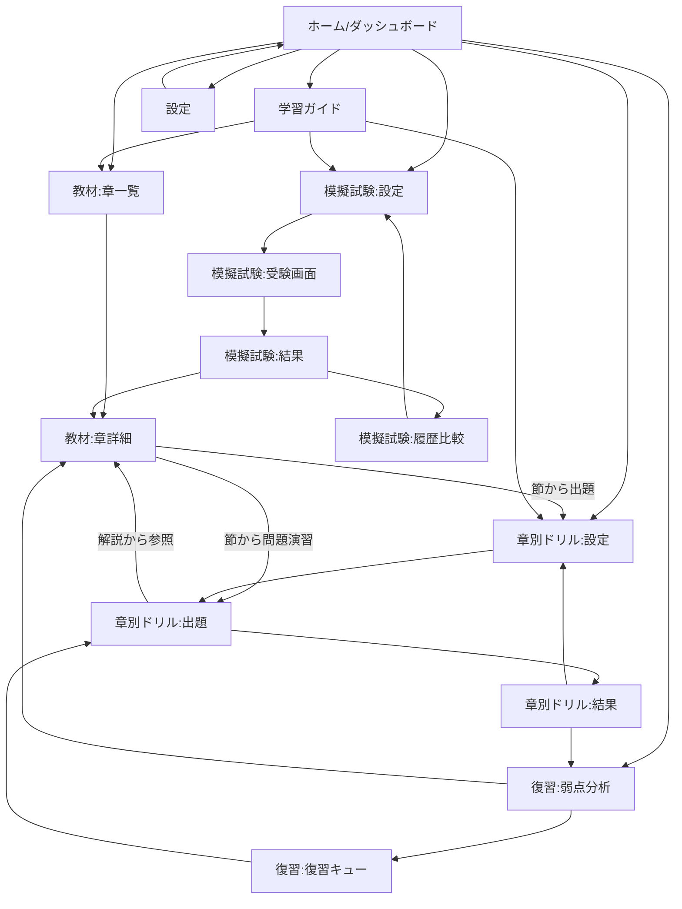

# フェーズ0：調査・設計資料（確定版）

作成日: 2026-08-01（初版）／改訂: 2026-08-01（第1章・第2章25問承認版）／改訂: 2026-08-02（全10章完成・アプリ完成工程反映版）
対象: G検定学習・演習アプリ スクラッチ開発
ステータス: 教材化および問題データ作成工程は完了（第1章〜第10章・全250問、詳細は19節）。アプリ完成工程（20節）も一通り完了し、フェーズ1〜4相当の機能（全章対応・復習・弱点分析・模擬試験・データ入出力・PWA/オフライン・アクセシビリティ対応・E2Eテスト）を実装済み。validate:questionsの警告172件の分類は21節・`docs/warning-classification.md`を参照。

このドキュメントは初版に対するユーザー承認（技術選定、Git管理方針、模擬試験出題比率、SRSアルゴリズム、タグ体系、レビュー体制、開発ツール、教材突き合わせ方式）を反映した確定版である。教材と全文版の全章突き合わせ結果は `docs/material-comparison-report.md` を参照。

---

## 1. 確認したファイル一覧

| ファイル                                   | 内容                                                       | 備考                                                                                                                                               |
| ------------------------------------------ | ---------------------------------------------------------- | -------------------------------------------------------------------------------------------------------------------------------------------------- |
| `CLAUDE.md`                                | 教材優先順位、必須ルール、問題データ推奨項目               | 本設計の制約条件の正本                                                                                                                             |
| `README.md`                                | リポジトリ概要、開発原則、推奨ディレクトリ                 | `materials/questions/scripts/docs/src/public` を推奨                                                                                               |
| `FILE_MANIFEST.txt`                        | リポジトリ内ファイル一覧                                   |                                                                                                                                                    |
| `materials/INDEX.md`                       | 章別ファイルの読み込み順、正規データの扱い方針             | 章別Markdownを優先せよと明記                                                                                                                       |
| `materials/chapters/00〜15` の全16ファイル | 表紙・はじめに・学習マップ・推奨学習順・第1〜10章・付録A/B | 全ファイルの見出し構造を全件抽出し、さらに全文版との内容突き合わせをプログラムで実施（結果は本書2.3節および `docs/material-comparison-report.md`） |
| `materials/G検定_学習テキスト_Rev0.md`     | 全文版（3557行）                                           | 章別Markdown16ファイルとの完全一致を機械的に確認済み                                                                                               |

第1章 (`04_第1章.md`, 228行) は内容を全文精読済み。他章は見出し構造（節タイトル・サブ構成）を全件確認済み。

---

## 2. 教材の章・節構造

### 2.1 全体構成

```
表紙・概要 / はじめに（学習の6段階） / 学習マップ / 推奨学習順
├ 第1章 人工知能とは                        （5節）
├ 第2章 人工知能をめぐる動向                （6節）
├ 第3章 機械学習の概要                      （8節）
├ 第4章 ディープラーニングの概要            （4.1〜4.7 = 7節）
├ 第5章 ディープラーニングの要素技術        （5.1〜5.12 = 12節）
├ 第6章 ディープラーニングの応用例          （6.1〜6.7 = 7節）
├ 第7章 AIの社会実装に向けて                （7.1〜7.6 = 6節）
├ 第8章 AIに必要な数理・統計知識            （8.1〜8.5 = 5節）
├ 第9章 AIに関する法律と契約                （9.1〜9.7 = 7節）
├ 第10章 AI倫理・AIガバナンス               （10.1〜10.8 = 8節）
├ 付録A 理解確認チェック120（項目チェックリスト、章横断、全120項目を件数確認済み）
└ 付録B 試験当日の戦い方（5項目 + AI活用時の注意）
```

節番号は第1〜3章が章内独立採番、第4〜10章は章番号付きで採番されており書式が統一されていない。アプリ側では `sectionId = ch{章番号2桁}-s{節連番2桁}` に正規化し、`sourceHeading` に原文の見出し文字列をそのまま保持する。

### 2.2 各章に共通する内部構造（第1〜10章で共通）

1. `## この章で学ぶこと`（章冒頭の到達目標リスト）
2. 各節：
   - `### まずイメージ` または `### 要点と使い分け`（どちらか一方）
   - `### 仕組みと背景`（深掘り説明。全節に存在するわけではない）
   - `#### この節のポイント`（箇条書きの要約。全節に存在）
3. `## 次章へのつながり`
4. `## 章末整理：〜`
   - `### この章の理解マップ`
   - `### 本文を補う用語`（本文にない補足用語。重要度ラベル A/B/C 相当の記法あり）
   - `### 重要な区別`（比較表）
   - `### 確認ポイント`

この構造は10章すべてで一貫しており、コンテンツパーサーの単一実装で全章に対応できる。

### 2.3 章別Markdownと全文版の突き合わせ結果（確定）

`scripts/compare-materials.mjs` により全16ファイルを機械的に突き合わせた結果、**本文差分ゼロ・見出し不一致ゼロ**を確認した。全文版は章別Markdown16ファイルを空行1行区切りで単純連結したものであり、両者は構造的に同一である。文字化け（Unicode置換文字）も検出されなかった。詳細は `docs/material-comparison-report.md` を参照。

この結果を踏まえ、**章別Markdown（`materials/chapters/`）をアプリのコンテンツ生成・問題作成における唯一の正本とする**。全文版は通読・横断検索用の参照ファイルとして維持し、ビルドパイプラインの入力対象にはしない。

教材が将来改訂された場合は `node scripts/compare-materials.mjs <対象番号>` で対象章のみ再検証し、`docs/material-comparison-report.md` に追記する運用とする。

---

## 3. 技術構成（確定）

| 領域           | 選定                                                                                              |
| -------------- | ------------------------------------------------------------------------------------------------- |
| フレームワーク | React + TypeScript（`strict: true`）                                                              |
| ビルド         | Vite                                                                                              |
| ルーティング   | React Router                                                                                      |
| 状態管理       | 後述3.1参照。すべてをZustandに集約しない                                                          |
| 永続化         | IndexedDB（`idb`ラッパー）                                                                        |
| スタイリング   | CSS Modules + CSS Custom Propertiesによるデザイントークン。UIフレームワークは初期版では導入しない |
| Markdown処理   | ビルド時変換（後述3.2参照）。実行時にMarkdownを直接パースしない                                   |
| スキーマ検証   | Zod（コンテンツJSON・問題データ双方の検証に使用）                                                 |
| PWA            | `vite-plugin-pwa`（導入自体はフェーズ4）                                                          |
| テスト         | Vitest（ユニット）／Playwright（E2E）                                                             |
| 静的解析・整形 | ESLint（コード品質）／Prettier（書式整形）／EditorConfig／TypeScript strict（後述7参照）          |

### 3.1 状態管理の役割分担

| 状態の種類                                 | 保存場所            | 例                                                                                                                                              |
| ------------------------------------------ | ------------------- | ----------------------------------------------------------------------------------------------------------------------------------------------- |
| 画面内だけで完結する一時的な状態           | `useState`（React） | 入力中の値、モーダル開閉、選択中の選択肢のハイライト                                                                                            |
| 複数画面で共有するが揮発性でよい学習状態   | Zustand             | 現在のドリル/模試セッションの出題キューと進行位置、直近の正誤フィードバック表示、ダッシュボード表示用の集計キャッシュ、テーマ設定のメモリ上の値 |
| 永続化が必要な学習履歴・模試履歴・復習情報 | IndexedDB           | `QuestionProgress` / `StudySessionLog` / `MockExamResult` / `MaterialReadState` / `UserSettings`                                                |

Zustandストアは永続化の主体にはしない。IndexedDBへの読み書きは `shared/lib/db` 層が担い、Zustandストアはその結果をメモリにキャッシュしてUIに配る役割に限定する（ストア初期化時にIndexedDBから読み込み、更新時は非同期でIndexedDBに書き込みつつストアも更新する、という一方向のデータフローとする）。

### 3.2 教材ビルドパイプライン（確定）

```
materials/chapters/*.md（正本）
   → scripts/build-content.ts（remark/unifiedでASTを走査し、章・節・ブロック単位に構造化）
   → Zodスキーマで構造を検証（見出し欠落や想定外の構造を検出）
   → content/chapters/ch{NN}.json + content/manifest.json を出力
   → アプリはこのJSONのみを読み込む（Markdownを実行時に解析しない）
```

生成JSONには元のMarkdownファイル名（`sourceFile`）、章ID、節ID、原文見出し（`sourceHeading`）を保持する。変換処理はスクリプトとして管理し、生成後のJSONを手作業で修正することは禁止する（修正が必要な場合はスクリプトまたは教材側を直す）。

---

## 4. Git管理方針（確定）

### Git管理するもの

- `materials/` 配下の教材Markdown原本
- `questions/` 配下の問題データ原本
- `content/` 配下の生成済み教材JSON（**確定済みのものに限り、初期段階ではGit管理する**）
- Zod等のスキーマ定義ファイル
- `scripts/` のMarkdown→JSON変換スクリプト、問題データ検証スクリプト
- アプリのソースコード（`src/`）
- 設定ファイル（`package.json`, `vite.config.ts`, `tsconfig.json` 等）
- テストコード（`tests/`）
- 公開に必要な固定データ（アイコン等）

### 原則としてGit管理しないもの

- `dist/`
- テストレポート
- Playwrightのスクリーンショット・動画
- 一時キャッシュ
- 開発中のログ
- `node_modules/`

### 生成JSON（`content/`）の扱い

初期段階ではGit管理し、生成結果の差分もレビュー対象とする（Claude Code on the web、GitHub Pages、CI等での再現性確保のため）。各生成JSONファイルの先頭には次のような注記を入れ、直接編集を禁止する。

```json
{
  "_generated": true,
  "_generatedBy": "scripts/build-content.ts",
  "_doNotEdit": "このファイルは自動生成物です。修正は materials/ または scripts/build-content.ts に対して行ってください。",
  ...
}
```

CIが安定した段階で、`content/` をGit管理対象から外すか改めて判断する。

---

## 5. 画面一覧

| #          | 画面                                       | 主な内容                                                                                                                         |
| ---------- | ------------------------------------------ | -------------------------------------------------------------------------------------------------------------------------------- |
| 1          | ホーム / ダッシュボード                    | 総合進捗、章別進捗、難易度別正答率、弱点（章・節・タグ）、未復習件数、直近学習履歴、模試得点推移、学習時間、今日の推奨アクション |
| 2          | 教材：章一覧                               | 全10章、章番号順⇄推奨学習順の切替、章別学習済み率                                                                                |
| 3          | 教材：章詳細（本文ビューア）               | 見出し単位ナビゲーション、まずイメージ/要点と使い分け・仕組みと背景・この節のポイントの表示、章末整理、既読状態の記録            |
| 4          | 章別ドリル：設定                           | 章・節・タグ・難易度（基礎/標準/応用）・出題範囲（未回答/誤答/未習得/ブックマーク）・出題数・ランダム化有無の指定                |
| 5          | 章別ドリル：出題                           | 4択問題、キーボード操作、回答後に正誤＋正解/誤答理由＋参照章節へのリンクを表示                                                   |
| 6          | 章別ドリル：結果サマリー                   | 今回の正答率、間違えた問題一覧、復習登録状況                                                                                     |
| 7          | 復習：弱点分析                             | 苦手章・節・タグの一覧、誤答→再習得までの履歴                                                                                    |
| 8          | 復習：復習キュー                           | SRSスケジュールに基づく推奨復習順、ブックマーク一覧                                                                              |
| 9          | 復習：出題                                 | 画面4/5と共通コンポーネントを再利用                                                                                              |
| 10         | 模擬試験：設定                             | 問題数・制限時間の選択                                                                                                           |
| 11         | 模擬試験：受験画面                         | タイマー、問題一覧からのジャンプ、後で確認フラグ、正誤非表示                                                                     |
| 12         | 模擬試験：結果                             | 総合点、章別/難易度別/タグ別成績、正答・誤答・未回答一覧、出題比率が「教材ベース配分」である旨の明記                             |
| 13         | 模擬試験：履歴比較                         | 過去の受験結果一覧と得点推移グラフ                                                                                               |
| 14         | 学習ガイド                                 | 学習の6段階、1〜3周目・直前期の使い方、現在地に応じた次の一手の提案、試験当日の戦い方（付録B）                                   |
| 15         | 設定                                       | ライト/ダークモード、データのエクスポート/インポート、学習履歴初期化（確認ダイアログ必須）                                       |
| 16（将来） | ログイン/組織/管理者機能のプレースホルダー | 初期版では非表示                                                                                                                 |

---

## 6. 画面遷移



ドリル出題中に閉じた場合は再開用の状態をIndexedDBに保存し、次回起動時に「続きから再開しますか」を提示する。

---

## 7. 開発ツール構成（確定）

| ツール       | 役割                                                                                       |
| ------------ | ------------------------------------------------------------------------------------------ |
| ESLint       | コード品質（未使用変数、React/TypeScriptのベストプラクティス違反等）                       |
| Prettier     | 書式整形のみ（`eslint-config-prettier`でESLintの書式系ルールを無効化し、二重管理を避ける） |
| TypeScript   | `strict: true` を含む厳格設定                                                              |
| EditorConfig | 改行コード・インデント・文字コードの統一                                                   |

npm scripts:

```
npm run lint          # ESLint実行
npm run format         # Prettierで整形（書き込み）
npm run format:check   # Prettierの整形チェックのみ（CI用）
npm run typecheck      # tsc --noEmit
npm run test           # Vitest（unit）
npm run build          # vite build
```

CI（GitHub Actions）で `lint` → `typecheck` → `test`（unit） → 問題データ検証（`validate-questions`） → `build` を実行する。HuskyやElint-staged等のGitフック系ツールは現時点では導入しない（npm scripts + CIを優先）。

---

## 8. データスキーマ（確定）

### 8.1 コンテンツ側（教材由来・ビルド生成物、`content/`）

```ts
interface Chapter {
  chapterId: string; // "ch01"
  number: number;
  title: string;
  sourceFile: string; // "materials/chapters/04_第1章.md"
  contentHash: string; // 教材ファイルのハッシュ（改訂検知用）
  recommendedOrderIndex: number;
  learningGoals: string[];
  sections: Section[];
  transitionNote: string;
  summary: ChapterSummary;
}

interface Section {
  sectionId: string; // "ch01-s01"
  index: number;
  title: string; // 原文見出し
  introType: "image" | "concise";
  introText: string;
  mechanismText?: string;
  keyPoints: string[];
}

interface ChapterSummary {
  conceptMap: string;
  supplementaryTerms: { term: string; importance: "A" | "B" | "C"; description: string }[];
  keyDistinctions: { item: string; criterion: string }[];
  checkpoints: string[];
}
```

### 8.2 タグ体系（確定方針・改訂版）

第1章25問の初回レビュー（フェーズ1）を踏まえ、`tags` は章・節・個別概念という3階層の分類軸に加えて、**表示用タグと内部管理用タグを区別する**ため、次の3種類のオブジェクトとして構成する（`chapterId`/`sectionId` は既存の別フィールドで章・節を構造化しているため、`tags` 自体に章タグを重複させない）。

1. **`contentTags`（表示用・個別概念タグ）**：例 `AI効果`, `チューリングテスト`, `中国語の部屋`。学習者向けUI（教材参照リンクや弱点タグ表示等）で将来表示しうるタグ。
2. **`skillTags`（内部管理用・出題意図タグ）**：`暗記` / `比較` / `関係性` / `適用判断` の4種類の固定語彙（CLAUDE.mdの「暗記だけでなく、比較、関係性、適用判断を問う」という方針に対応）。著者・レビューが出題意図の偏りを点検するための内部タグで、学習者向けUIには表示しない。1問に複数の`skillTags`を付与できるため、`skillTags`別に問題数を集計・表示する場合（レビュー用一覧、将来の管理画面等）は、件数合計が問題総数を超えうる旨を必ず注記すること。
3. **`crossChapterTags`（内部管理用・章横断タグ）**：例 `第2章:フレーム問題への伏線`。複数章にまたがる概念や、他章との接続を示す注記。著者・レビュー用の内部タグ。

付録A「理解確認チェック120」は `contentTags` の**候補の主要な出発点**として使用するが、そのまま唯一の正式タグ体系にはしない。全章の問題作成が進む過程で、以下の観点をチェックしたうえで正式な `contentTags` 一覧（`content/tags.json` 等）を確定する。

- 同義語の重複（例: 表記ゆれの統合）
- 粒度のばらつき（一部の項目が他より粗い/細かい）
- 複数章にまたがる概念（`crossChapterTags` として扱うか、代表章の `contentTags` とするか）
- 単独タグとして細かすぎる項目（上位テーマタグへ統合するか判断）
- 章・節の分類と一致しない項目

付録Aの原文自体は変更しない。タグ一覧の確定はフェーズ2（全章展開時）に行い、フェーズ1では第1章の範囲でのみ `contentTags` を暫定的に付与する。

### 8.3 問題データ（`questions/`）

第1章25問の初回レビューを踏まえ、`reviewStatus` は `draft`（ドラフト・レビュー待ち）／`approved`（承認済み）／`needs_revision`（要修正）の3値で管理する。

```ts
type Difficulty = "basic" | "standard" | "advanced";
type SkillTag = "暗記" | "比較" | "関係性" | "適用判断";

interface QuestionTags {
  contentTags: string[]; // 表示用・個別概念タグ（1件以上）
  skillTags: SkillTag[]; // 内部管理用・出題意図タグ（1件以上）
  crossChapterTags: string[]; // 内部管理用・章横断タグ（0件以上）
}

interface Question {
  id: string; // "ch01-basic-001"
  chapterId: string; // "ch01"
  sectionId: string; // "ch01-s01"
  difficulty: Difficulty;
  questionForm?: "affirmative" | "negative"; // 省略時は肯定形。21節（設問の予想可能性の是正）で追加
  question: string;
  choices: string[]; // 4件固定
  correctAnswer: number; // 0-3
  explanation: string;
  choiceExplanations: string[]; // 4件、choicesと同数
  tags: QuestionTags;
  sourceFile: string;
  sourceHeading: string;
  sourceReference: string;
  contentVersion: string;
  asOfDate?: string; // 時点依存情報がある場合の確認基準日
  createdAt: string;
  reviewStatus: "draft" | "approved" | "needs_revision";
}
```

### 8.4 SRS（間隔反復）データと状態遷移（確定）

学習状態は次の4状態を持つ。

- `not_started`（未学習）
- `learning`（学習中）
- `due_for_review`（要復習）
- `mastered`（習得済み）

復習段階（`srsStage`）は0〜4の5段階固定間隔とする。

| 段階 | 復習間隔       |
| ---- | -------------- |
| 0    | 当日または翌日 |
| 1    | 3日後          |
| 2    | 7日後          |
| 3    | 14日後         |
| 4    | 30日後         |

遷移ルール：

- 正解した場合：`srsStage` を1段階進める（最大4）。段階4で正解が続いた場合に `mastered` へ移行する。
- 誤答した場合：`srsStage` を**0へ戻さず、原則1〜2段階下げる**。ただし初回誤答（`attempts === 1` で誤答）または連続誤答（直近2回が誤答）の場合は早期再出題（段階0扱い）とする。
- 状態(`not_started`/`learning`/`due_for_review`/`mastered`)は `srsStage` と直近の正誤結果から導出する（例: 誤答直後は `due_for_review`、`srsStage` が上がり続けている間は `learning`）。

このロジックは `src/shared/lib/srs.ts` に、UIにも問題データにも依存しない純粋関数として実装し、将来SM-2等へ差し替え可能な形にする（入力: 現在の`QuestionProgress`と回答結果、出力: 更新後の`QuestionProgress`）。

```ts
interface QuestionProgress {
  questionId: string;
  status: "not_started" | "learning" | "due_for_review" | "mastered";
  srsStage: number; // 0-4
  attempts: number;
  incorrectCount: number;
  correctStreak: number;
  lastAnsweredAt: string | null;
  nextReviewAt: string | null;
  bookmarked: boolean;
  history: { answeredAt: string; result: "correct" | "incorrect"; selectedIndex: number }[];
}
```

### 8.5 模擬試験の出題比率（データ構造のみ確定、比率の確定値は全章完成後）

外部シラバスの配点比率を推測して固定しない。設定ファイルで変更可能な「教材ベース配分」として構造のみ定義する。

```ts
interface ExamCompositionConfig {
  version: string;
  basis: "content_volume"; // 教材ベース配分であることを明示（"official_syllabus"等は使わない）
  perChapter: {
    chapterId: string;
    weight: number; // 相対重み（章の問題数・教材内の分量を考慮）
    minRatio: number; // 出題比率の下限（極端な偏り防止）
    maxRatio: number; // 出題比率の上限
  }[];
}
```

模擬試験結果画面には「教材ベース配分」である旨を明記し、「本試験の公式配点」とは表示しない。正式な重みづけ（`weight`/`minRatio`/`maxRatio`の具体値）は全章の問題が完成した後に決定する。フェーズ1では模擬試験機能自体を実装しないため、この型定義と設定ファイルの雛形のみを用意する。

### 8.6 その他の永続データ

```ts
interface StudySessionLog {
  sessionId: string;
  type: "drill" | "review" | "mock_exam" | "material_reading";
  startedAt: string;
  endedAt: string | null;
  chapterIds: string[];
  questionIds: string[];
  scoreSummary?: { correct: number; total: number };
}

interface MockExamResult {
  examId: string;
  takenAt: string;
  durationSec: number;
  questionCount: number;
  answers: { questionId: string; selectedIndex: number | null; flaggedForReview: boolean }[];
  totalScore: number;
  byChapter: Record<string, { correct: number; total: number }>;
  byDifficulty: Record<Difficulty, { correct: number; total: number }>;
  byTag: Record<string, { correct: number; total: number }>;
}

interface MaterialReadState {
  sectionId: string;
  readAt: string | null;
}

interface UserSettings {
  theme: "light" | "dark" | "system";
  keyboardShortcutsEnabled: boolean;
}
```

IndexedDBストア構成: `questionProgress` / `studySessionLog` / `mockExamResults` / `materialReadState` / `userSettings`。エクスポート/インポートはこれら全ストアをまとめた単一JSONで行う。

---

## 9. ディレクトリ構成

```
G-Kentei/
├── materials/                 # 正本教材（既存・編集不可）
├── content/                   # materialsからビルド生成する構造化JSON（生成物・Git管理・直接編集禁止）
│   ├── manifest.json
│   ├── tags.json               # 正式タグ一覧（フェーズ2で確定）
│   └── chapters/ch01.json ...
├── questions/                 # 問題データ（レビュー対象）
│   ├── ch01/basic.json, standard.json, advanced.json
│   └── schema/                 # Zodスキーマ
├── scripts/
│   ├── build-content.ts        # materials/*.md → content/*.json
│   ├── compare-materials.mjs   # 章別Md/全文版の突き合わせ（既に導入済み）
│   ├── validate-questions.ts   # 問題データ品質検査
│   ├── generate-question-review.ts # レビュー用一覧生成
│   └── coverage-report.ts      # 章・節×問題の対応表生成
├── src/
│   ├── app/                    # ルーティング・レイアウト・グローバルナビ
│   ├── features/
│   │   ├── dashboard/ materials-viewer/ drill/ review/ mock-exam/ guide/
│   ├── entities/                # Question, Chapter, Progress等のドメイン型
│   ├── shared/
│   │   ├── ui/ lib/（idbラッパー、srs.ts、採点ロジック）/ hooks/
│   ├── styles/                  # デザイントークン、グローバルCSS
│   └── main.tsx
├── public/
│   ├── icons/
│   └── manifest.webmanifest
├── tests/
│   ├── unit/
│   └── e2e/
├── docs/
│   ├── phase0-design.md
│   ├── material-comparison-report.md
│   ├── content-mapping.md       # 章節×問題の対応表（自動生成）
│   └── ch01-question-review.md  # 第1章25問レビュー用一覧（フェーズ1成果物）
├── .github/workflows/ci.yml
├── package.json / vite.config.ts / tsconfig.json / vitest.config.ts / playwright.config.ts
├── .eslintrc.* / .prettierrc / .editorconfig
```

---

## 10. 問題生成と品質検査の方法

### 生成フロー

1. 対象章の章別Markdownを精読し、節ごとに出題候補を洗い出す（暗記／比較／関係性／適用判断の`skillTags`観点で分類し、同一節内で暗記に偏らないようにする）。
2. `questions/ch{NN}/{difficulty}.json` にドラフトを作成（`reviewStatus: "draft"`）。
3. 各問題に `sourceHeading` / `sourceReference` / `contentVersion` / `tags`（`contentTags`/`skillTags`/`crossChapterTags`）を付与。
4. `scripts/validate-questions.ts` を実行し、自動検査に通過させる。`npm run review -- ch{NN}`（`ch01`は`npm run review:ch01`のショートカットあり）でレビュー用一覧を生成し、節別・出題意図別の分布と、表現レベル／論点レベル双方の重複チェックを確認する。
5. 人間（ユーザー）がレビューし、`approved`（承認）または `needs_revision`（要修正、指摘事項に基づき1に戻る）に更新する。**承認を得るまで、次章の問題作成には着手しない。**

### 自動検査項目（`validate-questions.ts`）

- 問題ID重複チェック
- 必須項目欠落チェック
- 選択肢数が4件であること
- `correctAnswer` が0-3の範囲内であること
- `explanation` および `choiceExplanations` の各要素が空でないこと
- `sourceReference` が空でないこと、かつ `chapterId`/`sectionId` が `content/manifest.json` に実在すること
- 重複・類似問題の検出（正規化した問題文＋選択肢集合の類似度が閾値超のペアを警告）
- 難易度別・章別の問題数分布の偏り検出

検査結果は `docs/content-mapping.md`（章・節ごとの問題数一覧）として出力する。

### レビュー用一覧（`generate-question-review.ts`）が出力する分布・重複チェック

- 節別の基礎／標準／応用の問題数分布
- `skillTags`（暗記／比較／関係性／適用判断）別の基礎／標準／応用の問題数分布。**1問に複数の`skillTags`を付与できるため、この表の件数合計は問題総数を超える場合がある**（例: 「関係性」と「適用判断」を両方持つ問題は両方の列でカウントされる）。管理画面等で同様の集計を表示する場合も、この点を注記すること。
- 表現レベルの重複（問題文＋選択肢のトークン類似度0.8以上）
- 論点レベルの重複（同一節・`contentTags`完全一致）。表現を変えただけの水増しは、文面が大きく異なると表現レベルの類似度チェックをすり抜けることがあるため、`contentTags`が完全一致する組を別途機械的に検出し、人間が「同じ論点の言い換えでないか」を確認する。ただし、同一概念を基礎・標準・応用の異なる難易度・切り口で扱うことは意図的な設計であり、`contentTags`が一致していても内容が異なっていれば問題ない（レビュー時に個別に判断する）。

### 共通品質基準（第1章25問の初回レビューを踏まえて追加）

第2章以降の問題作成では、上記に加えて次を満たすこと。

- 各問題の誤答選択肢のうち、原則として少なくとも2つは、教材内の近接概念・混同しやすい概念・人物・年代・技術分類を用いた、もっともらしい誤答とする。
- 常識だけで即座に排除できる誤答（本文の理解を必要としない誤答）を必要以上に使用しない。
- 同一節内でも、事実・理由・比較・関係性・適用判断という観点を分散させ、同じ切り口の問題ばかりにしない。
- 各章のレビュー用一覧に、基礎・標準・応用と`skillTags`の分布を出力する（上記の通り`generate-question-review.ts`で対応済み）。
- 類似度検査（表現レベル）だけでなく、同一論点を異なる表現で繰り返していないか（論点レベルの重複）も確認する。

### 章ごとのレビューサイクル

第2章以降も、1章分（25問想定）を作成するたびに `npm run review -- ch{NN}` でレビュー用一覧を生成し、ユーザーの確認・承認を受けてから次章の問題作成に進む。承認前に複数章をまとめて作成しない。

---

## 11. フェーズ別実装計画とフェーズ1の受入基準（確定）

| フェーズ  | 主な成果物                                                                                                   |
| --------- | ------------------------------------------------------------------------------------------------------------ |
| 0（完了） | 本設計資料一式、教材突き合わせ報告                                                                           |
| 1（次）   | 下記参照                                                                                                     |
| 2         | 全章の教材データ・問題データ展開、正式タグ確定、復習機能、苦手分析、学習ガイド、教材参照リンク、データ入出力 |
| 3         | 模擬試験機能、成績分析、履歴比較、得点推移、E2Eテスト                                                        |
| 4         | オフライン対応、PWAインストール、パフォーマンス改善、アクセシビリティ確認、リリース手順・運用文書            |

### フェーズ1の実装対象

1. **プロジェクト雛形**：Vite + React + TypeScript(strict)、ESLint + Prettier + EditorConfig、npm scripts一式、GitHub Actions CI（lint/typecheck/test/validate-questions/build）。
2. **教材ビルドパイプライン**：`scripts/build-content.ts` を実装（少なくとも第1章分の変換・Zod検証・JSON出力が動作すること。全章対応は関数として汎用化してよいが、フェーズ1で全章分を実行・コミットする必要はない）。
3. **問題データ**：第1章25問（基礎10／標準10／応用5）を `questions/ch01/` に作成し、`validate-questions.ts` の全チェックに合格させる。
4. **SRSロジック**：`src/shared/lib/srs.ts` を純粋関数として実装し、単体テストを用意する。
5. **状態管理の土台**：Zustandストア（セッション状態用）とIndexedDBアクセス層（`idb`ラッパー）を役割分担どおりに実装する。
6. **教材ビューア（第1章のみ）**：見出し単位ナビゲーション、この節のポイント等の表示、既読状態の記録。
7. **章別ドリル（第1章25問のみ）**：出題、キーボード操作、回答後の正誤・全選択肢の解説・参照節リンクの表示、回答結果のIndexedDB保存とSRS状態更新。
8. **簡易ダッシュボード**：第1章の進捗・正答率・直近履歴の実データ表示（他章分・模試分は対象外）。
9. **ライト/ダークモード**。
10. **レビュー用出力**：`scripts/generate-question-review.ts` により、第1章25問を問題文・正答・全選択肢・解説・難易度・タグ・参照節・重複チェック結果とともに一覧化した `docs/ch01-question-review.md` を生成する。
11. **単体テスト**：SRSロジック、採点ロジック、問題データ検証スクリプト、教材ビルドパイプラインの主要ケース。

PWA（Service Worker等）はフェーズ4まで導入しない。復習機能・模擬試験・全章展開はフェーズ2以降。

### フェーズ1の受入基準（チェックリスト）

- [ ] `npm run lint` / `format:check` / `typecheck` / `test` / `build` がすべて成功する
- [ ] GitHub ActionsのCIが上記＋問題データ検証を自動実行し、成功する
- [ ] `content/chapters/ch01.json` が生成され、`content/manifest.json` に第1章の章・節ID一覧が含まれる
- [ ] `questions/ch01/` に基礎10・標準10・応用5＝25問が存在し、`validate-questions.ts` がエラー0件で通過する
- [ ] 25問すべてが4択、`correctAnswer`が範囲内、`choiceExplanations`が4件、`sourceReference`が第1章の実在節を指している
- [ ] `docs/ch01-question-review.md` が生成され、25問を通読できる（問題文・正答・全選択肢の解説・難易度・タグ・参照節・重複チェック結果を含む）
- [ ] 教材ビューアで第1章の本文が見出しごとに表示され、この節のポイント等が表示される
- [ ] ドリル画面で25問を出題でき、キーボードのみで回答できる
- [ ] 回答後に正誤、正解の解説、誤答選択肢ごとの理由、参照節が表示される
- [ ] 回答結果がIndexedDBの`QuestionProgress`に保存され、SRSの状態（未学習→学習中→要復習/習得済み）が更新される
- [ ] ページをリロードしても進捗が保持される
- [ ] ライト/ダークモードの切替が機能する
- [ ] SRSロジック・採点ロジック・スキーマ検証のVitestユニットテストが存在し、成功する
- [ ] 上記すべてが揃った時点で実装を止め、`docs/ch01-question-review.md` によるユーザーレビューを受ける（このレビュー完了まで第2章以降の問題作成に着手しない）

---

## 12. 想定されるリスク

1. **教材からの逸脱（ハルシネーション）リスク**：対策として全問題に `sourceHeading`／`sourceReference` を必須化し、レビュー時に本文と突き合わせる。
2. **問題の水増し・類似問題によるドリル効果の低下**：類似度チェックを自動検査に組み込む。
3. **IndexedDBの利用制約**：プライベートブラウジング等での保存失敗に対し、フェーズ1では最小限のエラーハンドリングのみ行い、フェーズ4で強化する。
4. **教材改訂と問題データの追従漏れ**：`content/` のハッシュ管理により検知可能だが、再レビューは人手に依存する。運用ルールは本書とdocsで明文化済み。
5. **模擬試験出題比率の妥当性**：正式な重み付けは全章完成後に確定する前提のため、フェーズ1〜2の間は暫定値である旨を明記する。
6. **タグ体系の未確定によるフェーズ1範囲での揺れ**：第1章のみのタグ付けはフェーズ2で正式タグに置き換わる可能性がある。フェーズ1の問題データの`tags`は暫定扱いであることをレビュー時に明示する。
7. **スコープの大きさ**：フェーズを厳格に区切り、フェーズ1完了時点で必ずレビューを挟む。

---

## 13. 今回までに解消した判断事項と対応

| 事項                      | 結論                                                                                       |
| ------------------------- | ------------------------------------------------------------------------------------------ |
| 技術選定詳細              | 確定（本書3節）                                                                            |
| `content/`のGit管理       | 初期段階はGit管理する（本書4節）                                                           |
| 模擬試験出題比率の根拠    | 教材ベース配分とし、構造のみ先行設計。数値は全章完成後（本書8.5節）                        |
| SRSアルゴリズム           | 簡易Leitner方式、5段階、誤答時は1〜2段階ダウン（本書8.4節）                                |
| 付録A120項目とタグ体系    | 個別概念タグの候補ベースとし、3階層タグ体系を別途設計（本書8.2節）                         |
| 第1章25問のレビュー時期   | フェーズ1完了時点で一度停止しレビュー（本書11節）                                          |
| ESLint/Prettier等         | 導入する（本書7節）                                                                        |
| 章別Md/全文版の突き合わせ | フェーズ1着手前に一括実施済み、差分ゼロ（本書2.3節、`docs/material-comparison-report.md`） |

現時点で追加の承認待ち事項はない。次のアクションは、本書11節のフェーズ1実装対象・受入基準についてユーザーの最終確認を得たうえでの着手となる。

---

## 14. 第1章25問レビュー（1回目）の指摘事項と対応

フェーズ1完了時点で提示した第1章25問について、ユーザーから以下6点の修正指示を受け、対応した。詳細な変更前後の一覧は `docs/ch01-question-review-changelog.md` を参照。

| #   | 指摘事項                                             | 対応                                                                                                                                                                                                                                    |
| --- | ---------------------------------------------------- | --------------------------------------------------------------------------------------------------------------------------------------------------------------------------------------------------------------------------------------- |
| 1   | 基礎問題2〜3問を暗記確認から具体例への適用問題へ変更 | `ch01-basic-003`（電卓の例）／`ch01-basic-006`（画像認識の猫犬判定）／`ch01-basic-008`（チャットボットのシナリオ）の3問を適用判断型に書き換え                                                                                           |
| 2   | 節間の問題数偏り・同一論点への集中の一覧化と調整     | `npm run review:ch01` に節別・`skillTags`別の分布集計を自動出力する機能を追加。5節×5問（各20%）で件数は均等だったが、第1節内で内容が重複していた `standard-002` を松尾豊の位置づけを問う設問に差し替え、内容面の集中を解消              |
| 3   | 常識のみで除外できる誤答選択肢の置き換え             | `basic-003`「研究予算」、`standard-003`「価格」「政府認定」、`standard-009`「法律上の要件」、`standard-010`「実施コスト」を、教材内の近接概念（シンギュラリティ、身体性、チューリングテスト、強いAI等）を用いた紛らわしい誤答へ置き換え |
| 4   | 表示用／内部管理用タグの分離                         | `tags` を `contentTags`（表示用・概念）／`skillTags`（内部管理用・暗記/比較/関係性/適用判断）／`crossChapterTags`（内部管理用・章横断）の3種類に再構成（本書8.2〜8.3節）                                                                |
| 5   | レビュー状態の3値管理                                | `reviewStatus` を `draft`／`approved`／`needs_revision` の3値に変更（本書8.3節）                                                                                                                                                        |
| 6   | 修正版一覧の再生成と変更点報告                       | `docs/ch01-question-review.md` を再生成。`docs/ch01-question-review-changelog.md` に変更前後の問題IDと変更内容を記録                                                                                                                    |

この修正版についても、ユーザーの明示的な承認を得るまで第2章の問題作成には着手しない。

---

## 15. 第1章25問の正式承認と今後の運用

上記6点の対応内容を確認したユーザーから、第1章25問について正式承認を得た。`questions/ch01/{basic,standard,advanced}.json` 全25問の `reviewStatus` を `approved` に更新し、`docs/ch01-question-review.md` を再生成した。

承認にあわせて、以下を今後の問題作成の共通品質基準として追加した（詳細は本書10節）。

1. 誤答選択肢のうち原則2つ以上は教材内の近接概念・混同しやすい概念・人物・年代・技術分類を用いる。
2. 常識のみで排除できる誤答を必要以上に使用しない。
3. 同一節内でも事実・理由・比較・関係性・適用判断の観点を分散させる。
4. 各章のレビュー用一覧に基礎・標準・応用と`skillTags`の分布を出力する。
5. 表現レベルの類似度検査に加え、`contentTags`完全一致による論点レベルの重複検査も行う。

また、`skillTags`は1問に複数付与できるため、分布集計の件数合計が問題総数を超えうる旨を、レビュー用一覧・本書双方に注記した（本書10節）。

第2章以降は、当初のフェーズ計画（本書11節）に従って全章展開を進める。ただし、章ごとに次のサイクルを徹底する。

```
1章分（25問想定）の教材データ・問題データを作成
→ npm run build:content / validate:questions / review -- ch{NN} を実行
→ docs/ch{NN}-question-review.md をユーザーに提示
→ ユーザーの確認・承認を得る
→ 承認後、次章に着手（未承認のまま複数章を先行作成しない）
```

上記サイクルに従い、第2章（6節）についても`content/chapters/ch02.json`の生成、25問（基礎10／標準10／応用5）の作成、`validate:questions`によるエラー0件の確認、`docs/ch02-question-review.md`（全問詳細表示）の生成まで完了した。第2章はユーザーの確認待ちであり、承認前に第3章の問題作成には着手していない。

---

## 16. 第3章以降の運用方針（開発速度向上・確定）

第1章・第2章の全問レビューにより問題スキーマ・タグ設計・品質基準が他章でも再現できることを確認できた前提で、第3章以降は次の運用に切り替える。第1章・第2章は「全問詳細レビュー」という基準点として扱い、以降の章もこの基準を満たすことを前提とする。

### 16.1 自動検査（`validate:questions`、`review -- ch{NN}` 共通）

`scripts/lib/question-quality-checks.ts` に検査ロジックを集約し、`validate-questions.ts` と `generate-question-review.ts` の双方から参照する（章ごとの個別実装を増やさない）。実施する検査は次の通り。

- スキーマ検証（Zod）
- 教材参照先（`chapterId`/`sectionId`）が `content/manifest.json` に実在するかの確認
- 選択肢数（4件固定）・正解番号の範囲（0-3）の検証
- 必須解説（`explanation`/`choiceExplanations`）の欠落確認
- 類似問題検査（表現レベル：問題文＋選択肢のトークン類似度0.8以上）
- 論点レベルの重複検査（同一節・`contentTags`完全一致。表現を変えただけの水増しの検出を補完する）
- 節別・難易度別・`skillTags`別の分布集計
- 誤答選択肢の近接概念チェック（`contentTags`の語彙が誤答選択肢の文中に現れるかの機械的な近似判定。全章横断で語彙を構築し、他章の概念を用いた誤答も検出する）
- 章の問題数が設計値（既定25問、基礎10／標準10／応用5）と一致しているかの確認
- 正答位置の偏り検査（正答がすべて同じ選択肢に固定されている、またはいずれかの選択肢に40%超集中している場合に警告）
- 応用問題に事例適用型（`skillTags`に「適用判断」を含む問題）が最低1問含まれているかの確認
- 誤答選択肢に極端な断定表現（「完全に解決した」「無関係である」「使い分けは存在しない」等の固定リスト）が含まれていないかの確認
- 正答選択肢が最長の誤答選択肢に比べて極端に長くないか（文字数比1.6倍超で警告）の確認

近接概念チェックは語の一致に基づく粗いヒューリスティックであり、良質な誤答でも具体的な言い回し（固有名詞や事例で概念を示す等）によっては検出できないことがある（第1章・第2章の承認済み問題でも一定数が「検出できず」の判定になることを確認済み）。そのため閾値は「誤答3件中1件も一致しない」場合のみを警告とする控えめな設定とし、判定はあくまで人間による重点レビューを補助する参考情報として扱う。

上記はすべて`validate:questions`実行時に警告（`WARN`）として出力され、ビルドやCIを失敗させるものではない。品質基準10節が明記する通り、これらは「機械的な近似指標」であり、最終判断は人間の重点レビューに委ねる。

なお、選択肢のシャッフル表示（正答位置を毎回ランダム化してドリル・模擬試験に出題する機能）は、正答判定を選択肢の表示位置ではなくデータ側のインデックスに紐づける実装、解説の対応関係の維持、復習・結果画面での固定表示の排除、シャッフル後の正答判定を確認する自動テストなど、UI層に踏み込んだ設計変更を要するため、フェーズ1で構築した現在のドリル画面にはまだ導入していない。第2章の対応では、この代替手段として明示的に認められている「JSON上の正答位置の分散」で対応した（本書17節参照）。シャッフル機能の実装は、フェーズ2以降のドリル・模擬試験機能の拡張時に改めて設計する。

### 16.2 重点レビューの自動抽出

`npm run review -- ch{NN} --focused` を実行すると、以下を「重点レビュー対象」として自動抽出し詳細表示する。それ以外は簡易表示（ID・難易度・問題文・正解・表示用タグのみの一覧）とする。

- 応用問題は件数によらず全問（正答の一意性・章横断の関係づけなど、確認価値が最も高いため）
- `crossChapterTags`を持つ全問題（教材横断の接続を扱うため、正確性の確認価値が高い）
- 基礎2問・標準3問の代表サンプル（節の並び順で先頭から選ぶ）
- 自動検査で警告が出た全問題（類似問題、論点重複、近接概念チェック等）

通常は合計8〜12問程度が重点レビュー対象となる。第1章・第2章は基準点として全問詳細表示（`--focused`なし）を維持し、第3章以降はこの重点レビュー方式を既定とする。レビュー用一覧の冒頭には、正答位置別件数・正答率、問題文の形式別件数、応用問題の`skillTags`分布、正答と最長誤答の文字数比が大きい問題、極端な断定表現を含む誤答がある問題、事例適用型問題数、章横断問題数を集計した「冒頭サマリー」を出力する（`generate-question-review.ts`の`renderSummaryMetrics`）。

### 16.3 バッチ単位と停止条件

- 第3章以降は、原則として2章ずつ（例: 第3章・第4章 → 第5章・第6章 → 第7章・第8章）作成し、自動検査結果と重点レビュー一覧をまとめて提示したうえで承認を得てから次のバッチへ進む。
- 時点依存性が高い第9章（法律・契約）・第10章（AI倫理・AIガバナンス）は、1章ずつ作成・停止・確認する。
- 次のいずれかに該当する場合のみ、バッチ内でも章単位で停止しユーザーに確認する。軽微な表現修正のみでは停止しない。
  - 教材記述に矛盾や疑義がある
  - 自動検査で重大エラー（スキーマ検証エラー等、`validate:questions`が非0で終了する水準）が出た
  - 応用問題の正答が一意に定まらない可能性がある
  - 教材参照先が不足している
  - 章全体の問題品質が第1章・第2章の基準を満たさないと判断される

### 16.4 テンプレート化した共通資産

以下は章ごとに再実装せず、全章で共通利用する。

- 問題データスキーマ（`src/schemas/question.schema.ts`）
- タグ設計（`contentTags`/`skillTags`/`crossChapterTags`、本書8.2節）
- `reviewStatus`の3値管理（本書8.3節）
- 誤答選択肢の品質基準（本書10節の共通品質基準）
- 節別・難易度別・`skillTags`別の分布集計ロジック（`scripts/lib/question-quality-checks.ts`）
- レビュー用Markdown生成（`scripts/generate-question-review.ts`、全問表示／重点レビュー表示の両モード）
- 自動検証スクリプト（`scripts/validate-questions.ts`）

---

## 17. 第2章25問レビュー（2回目）の指摘事項と対応

第2章25問について、ユーザーから以下の指摘を受け対応した。第2章は今回も全問レビュー方式（基準点）を維持し、第3章以降から16節の重点レビュー方式・2章バッチ・自動品質ゲートの運用に切り替える。

### 17.1 全問共通の修正：正答位置の偏り解消

25問すべての正答が選択肢1に固定されていたため、選択肢を並び替えて正答位置を分散した（選択肢の並び順のみを変更し、各選択肢のテキスト・解説の対応関係は保持）。

- アプリ側での選択肢シャッフル表示は、正答判定をデータ側インデックスに紐づける実装・解説の対応維持・復習/結果画面での固定表示の排除・シャッフル後の正答判定を確認する自動テストなど、UI層の設計変更を要するため、フェーズ1の現状のドリル画面には未実装（本書16.1節に追記）。
- 代替手段として明示的に許容されている「JSON上の正答位置の分散」で対応した。
- 結果: 選択肢1=6問／選択肢2=6問／選択肢3=6問／選択肢4=7問（目標の6/6/6/7と一致）。
- `validate-questions.ts`・`generate-question-review.ts`に正答位置分布の集計・偏り警告を追加した（本書16.1節）。

**既知の関連事項（第1章）**：同じ観点で確認したところ、承認済みの第1章25問は 選択肢1=9問／選択肢2=13問／選択肢3=2問／選択肢4=1問 であり、新設した偏り検査（40%超で警告）に抵触する（選択肢2に52%集中）。第1章は承認済みのため、今回のユーザー指示（対象:第2章）の範囲外として変更していない。第1章についても同様の位置分散を行うかは、別途ご判断を仰ぐ。

### 17.2 個別問題の内容修正

- **`ch02-standard-009`（基盤モデルの説明）**：正答選択肢・正答解説の表現を、ユーザー提示の修正案の通りに変更した（「追加の学習(ファインチューニングやプロンプトの工夫)なしに」という、プロンプトの工夫を学習の一種であるかのように扱う表現を解消）。教材本文（`materials/chapters/05_第2章.md` 第6節）にも同一表現があったため、ユーザーの明示的な指示に基づき教材本文および`G検定_学習テキスト_Rev0.md`の該当箇所も修正した（詳細は`docs/material-comparison-report.md` 5節）。修正に伴いcontentHashが変化したため、`content/chapters/ch02.json`を再生成し、`questions/ch02/*.json`全25問の`contentVersion`を更新した。
- **`ch02-advanced-002`（知識工学と機械学習の違い）**：誤答選択肢の解説にあった「機械学習は人間が特徴量やルールを事前に設計するのではなく」という断定的すぎる表現を、ユーザー提示の修正案（判断規則をデータから学習するか否かが本質的な違いであるという表現）に差し替えた。教材本文には同様の断定表現が存在しなかったため、教材本文の修正は行っていない。

### 17.3 重複問題の整理

`ch02-standard-006`と`ch02-advanced-004`が実質的に同じ理解（Deep Blue→Ponanza→AlphaGoの技術的重心の変化）を確認する問題になっていたため、`ch02-standard-006`を残し、`ch02-advanced-004`をユーザー提示の事例へ差し替えた。新しい`ch02-advanced-004`は、局面評価とシミュレーション探索を組み合わせる架空のゲームAIの事例を提示し、教材が示す技術的変遷のどの段階に該当するかを判断させる事例適用型の問題とし、`skillTags`に`適用判断`・`関係性`を付与した。

### 17.4 難易度設計の改善

応用5問の`skillTags`を、`ch02-advanced-004`の差し替えにより関係性偏重から調整した（関係性を中心としつつ、`比較`・`適用判断`を含める構成）。`hasCaseApplicationInAdvanced`チェックにより、応用問題に事例適用型が最低1問含まれることを今後自動確認する。

### 17.5 誤答選択肢の近接概念チェックに関する扱い

自動チェックで「近接概念を含む誤答不足」と判定された5問（`ch02-basic-003`,`005`,`006`,`standard-003`,`advanced-002`）について、人間によるレビューでは実際には機械学習・MCTS・身体性等の教材内の別概念が誤答に含まれていることを確認した。ご指摘の通り、これらは自動修正の対象とせず、人間レビューの候補として表示するに留める。検出ロジックの改善（`contentTags`の完全一致だけでなく類義語や説明文も考慮する）は今後の課題として記録する。

### 17.6 選択肢表現・問題文バリエーションの品質基準

正答だけが極端に長い、誤答に極端な断定表現が集中している、といった品質基準を`scripts/lib/question-quality-checks.ts`に自動検査として実装した（本書16.1節）。問題文の形式バリエーションについては、差し替えた`ch02-advanced-004`に事例提示型の言い回し（「〜のどの段階に最も近いか」）を採用し、今後の章で徐々に多様化する方針とする。全25問を一律に書き換える対応は行っていない。

### 17.7 今後の自動品質ゲート（20項目）と運用

ユーザーが提示した20項目の自動品質ゲート候補について、今回実装したものと未実装のものを整理する。

| #   | 項目                                         | 状態                                                                                              |
| --- | -------------------------------------------- | ------------------------------------------------------------------------------------------------- |
| 1   | 問題数が設計値と一致                         | 実装済み（`checkQuestionCountsAgainstDesign`）                                                    |
| 2   | 基礎・標準・応用の件数が設計値と一致         | 実装済み（同上）                                                                                  |
| 3   | 節別の問題数に過度な偏りがない               | 実装済み（節別分布集計、0件の節を警告）                                                           |
| 4   | 正答位置が特定の番号に偏っていない           | 実装済み（`findAnswerPositionSkewWarning`）                                                       |
| 5   | 選択肢シャッフル時の正答判定・解説対応の維持 | 未実装（アプリ側シャッフル自体が未実装のため対象外。本書16.1節）                                  |
| 6   | 表現レベルの高類似問題がない                 | 実装済み（`findSimilarPairs`）                                                                    |
| 7   | 同一論点の重複問題がない                     | 実装済み（`findContentTagOverlaps`、機械的近似）                                                  |
| 8   | 正答が一意である                             | スキーマ上`correctAnswer`は単一インデックスのため構造的に保証。内容面の一意性は人間レビューに依存 |
| 9   | 正答と正答解説が一致している                 | 未実装（内容の意味的一致はNLPを要し自動化が困難。人間レビューに依存）                             |
| 10  | 各誤答の説明が選択肢の内容と一致している     | 未実装（同上）                                                                                    |
| 11  | 教材参照先が存在する                         | 実装済み（`sectionId`/`chapterId`のmanifest実在確認）                                             |
| 12  | 問題内容が教材参照先に含まれている           | 未実装（内容の意味的検証は人間レビューに依存）                                                    |
| 13  | `contentTags`が問題内容と一致している        | 未実装（同上）                                                                                    |
| 14  | `skillTags`が実際の出題意図と一致している    | 未実装（同上）                                                                                    |
| 15  | `crossChapterTags`と参照先章が一致している   | 未実装（今後、章番号の形式チェック程度は自動化可能）                                              |
| 16  | 応用問題に事例適用型が最低1問含まれる        | 実装済み（`hasCaseApplicationInAdvanced`）                                                        |
| 17  | 正答だけが極端に長くない                     | 実装済み（`findChoiceLengthImbalances`）                                                          |
| 18  | 選択肢間の文量と具体性に極端な差がない       | 部分実装（文字数の比較のみ。「具体性」の差は人間レビューに依存）                                  |
| 19  | 誤答に極端な断定表現が集中していない         | 実装済み（`findExtremePhraseUsages`）                                                             |
| 20  | 全問題の`reviewStatus`が正しく管理されている | スキーマのenum制約により構造的に保証                                                              |

意味内容の正確性に関わる項目（9・10・12・13・14）は、機械的な自動化が困難なため、`--focused`モードで抽出される重点レビュー対象（応用問題全問・章横断問題全問・警告のあった問題）を中心に人間が確認する運用とする。

第3章以降は、ユーザーが提示した進め方（Claude Codeが問題を生成→自動品質ゲート実行→警告問題のみ修正→応用問題と章横断問題を重点確認→集計結果を提示→原則25問個別レビューは省略）に従う。ただし次の場合は例外として個別レビューを行う：新しい問題形式を導入した章、法律・倫理・ガバナンス等の表現の正確性が特に重要な章（第9章・第10章）、自動チェックで多数の警告が出た章、教材本文を大幅に改訂した章、正答の一意性に疑義がある章。

新しい章に着手する際は、上記の型・スクリプトをそのまま再利用し、教材内容に固有の部分（問題文・選択肢・タグの中身）のみを作成する。

---

## 18. 第2章25問の正式承認

ユーザーから、17節で対応した修正内容（正答位置の分散、`ch02-standard-009`・`ch02-advanced-002`の内容修正、`ch02-advanced-004`の事例適用型への差し替え、冒頭サマリー・自動品質ゲートの追加）を確認したうえで、第2章25問について正式承認を得た。

- `questions/ch02/{basic,standard,advanced}.json` 全25問の `reviewStatus` を `approved` に更新し、`docs/ch02-question-review.md` を再生成した。
- 自動集計に残る「正答文の長さ」「極端な断定表現」「近接概念不足」の警告（各5〜11件）は、修正必須のエラーではなく人間レビュー用の参考情報として扱うことをユーザーが明示的に確認した。第2章については、これらを理由とした追加の全面修正は行わない。
- 第1章の正答位置分布（選択肢2に52%集中、本書17.1節で既知の事項として記録）については、今回のやり取りでは対応方針の指示がなかったため、`reviewStatus: approved`のまま変更していない。対応の要否は別途の指示があった場合に検討する。

第3章以降は、本書16節・17.7節で確定した運用（2章ずつのバッチ、`--focused`モードによる重点レビュー、20項目の自動品質ゲート）に完全に移行し、原則として全25問の個別レビューは行わない。

## 19. 第3章〜第10章の完成と第1章正答位置是正（教材化・問題データ作成工程の完了）

本書16節・17.7節で確定した運用（2章ずつ、その後3章バッチ・自律進行へ移行）に従い、
第3章から第10章までの計200問を作成し、全10章・250問の問題データが完成した。

- **バッチ構成**: 第3〜4章（個別レビュー付き）→第5〜7章（自律バッチ、完了後報告）→
  第8章（数理・統計分野、自律承認）→第9章・第10章（法律・倫理分野、1章ずつ・厳格な
  判断待ち抽出）の順で進行し、各バッチ完了時にユーザーの確認を受けた。
- **教材パーサーの拡張**: 第5章（学習目標末尾の補足段落）、第9章（節内の表組み、
  「この節のポイント」見出しレベルの揺れ）、第10章（「次章へのつながり」見出しの結合）
  という章ごとのMarkdown構造差に対応するため、`scripts/lib/parse-chapter.ts` を4回拡張した。
  いずれも既存章の`contentHash`に影響しない追加的な変更であることをビルド再実行で確認済み。
- **正答位置の割り当て**: 第3章以降は、章内の出題順（基礎→標準→応用）を4で割った余りで
  正答位置を機械的に割り当てる方式を採用し、各章とも正答位置が7/6/6/6程度に分散するよう
  設計した。
- **第1章の正答位置是正**: 第1章のみ、上記方式導入前に作成されていたため正答位置が
  選択肢2に52%集中していた（17.1節で既知の事項として記録）。ユーザー指示に基づき、
  問題文・正誤内容・解説・タグ・難易度・教材参照・問題IDを一切変更せず、選択肢の並び順と
  正答番号・選択肢説明の対応関係のみを変更する方式で是正した。17問の選択肢を巡回シフトし、
  第1章の正答位置分布を7/6/6/6（目標の5〜7問・最大差2問以内・4問以上の連続なしをすべて
  満たす）に是正した。変更前後で選択肢テキスト・解説テキストの多重集合が完全一致することを
  プログラムで検証済み。詳細な問題ID単位の対応表と検証方法は
  `docs/ch01-answer-position-remediation.md` を参照。
- **完成時点の状態**: 全250問について `npm run validate:questions` がエラー0件（警告172件、
  分類は21節）、`npm run ci` の全工程（lint/typecheck/test/validate:questions/build）が成功。
  第1章・第2章は `reviewStatus: approved`、第3章〜第10章は `reviewStatus: draft`
  （バッチ処理移行後は個別承認ではなく自動品質ゲート通過をもって次章へ進む運用のため）。

この完了をもって、CLAUDE.mdが定める「教材化および問題データ作成工程」を第1章〜第10章の
全範囲で終了し、以降はアプリ完成工程（20節）に移行した。

## 20. アプリ完成工程（フェーズ1〜4相当の実装）

19節の完了を受け、ユーザーから問題追加ではなくアプリ完成工程へ進むよう指示を受けた。
11節で定義したフェーズ1〜4の対象機能を、優先順位付きで実装した。フェーズ1時点では
第1章のみに限定されていた実装を全10章対応へ拡張し、フェーズ2〜4相当の機能
（復習・弱点分析・模擬試験・データ入出力・PWA・アクセシビリティ・E2Eテスト）を一括で
実装した。

| 優先順位 | 内容                                   | 実装概要                                                                                                                                                      |
| -------- | -------------------------------------- | ------------------------------------------------------------------------------------------------------------------------------------------------------------- |
| 1        | 全10章・250問のアプリ組み込み          | `content-loader.ts`・`question-loader.ts` を全10章対応に変更（従来は第1章のみをハードコード）                                                                 |
| 2        | 教材ビューア・章別ドリルの全章動作確認 | 章選択UIを追加、`ChapterListPage`の推奨学習順ソートを実装、全章でブラウザ動作確認                                                                             |
| 3        | IndexedDB進捗の保存・復元確認          | 全章の回答結果・既読状態がリロード後も復元されることを確認                                                                                                    |
| 4        | SRS復習・誤答復習・ブックマーク        | 新機能「復習」（SRS期限到来・誤答のみ・ブックマークの3種、章横断）、ドリル画面へのブックマークトグルを追加                                                    |
| 5        | ダッシュボード・弱点分析               | ホーム画面に全章横断サマリーを追加、新規「弱点分析」画面（出題形式・難易度・章・節別正答率、弱点候補節の抽出）                                                |
| 6        | 模擬試験機能                           | 8.5節の出題比率設定を確定し（章の節数を教材分量の代理指標とする重み付け、±40%の許容幅）、模試の設定・受験・結果画面を実装                                     |
| 7        | データのエクスポート・インポート       | `exportAllData`に加え`importAllData`を実装、設定画面にJSONファイルの書き出し・読み込みUIを追加（インポート時はZodスキーマで検証）                             |
| 8        | PWA・オフライン対応                    | `vite-plugin-pwa`を導入し、教材・問題データがビルド時にJSへ内包される構成を活かしてアプリシェル全体をプリキャッシュ、オフラインでの再読み込み・画面遷移を確認 |
| 9        | アクセシビリティ・レスポンシブ対応     | axe-coreによるWCAG 2 A/AA監査（全画面・全セッション状態で0件）、375px幅での横スクロール発生（0件に修正）を実施                                                |
| 10       | E2Eテスト・最終品質監査                | Playwrightによる主要動線のE2Eテスト15件（ナビゲーション・ドリル・復習・模試・データ入出力）、警告172件の分類（21節）                                          |

実装の過程で、ドリル・復習・模試の各結果画面が、Reactの開発モード（StrictMode）における
副作用の二重実行によって「結果がありません」と誤表示される不具合を発見・修正した
（原因はアンマウント時クリーンアップでのセッションリセットを、退出リンクのクリック時
リセットに変更したこと）。本番ビルドでは元々発現しない問題だったが、開発時の動作確認を
妨げるため修正した。

## 21. validate:questions警告の分類とRelease Candidate 1向け重点対応

全250問に対する `npm run validate:questions` の警告172件を、公開判断の観点から
「意図的で問題なし」「将来改善候補」「本番公開前に再確認必須」の3分類に整理した
（初回分類）。その後、ユーザーからのRelease Candidate 1向け最終確認指示を受け、
「本番公開前に再確認必須」とした7件と、「将来改善候補」のうち特に優先度が高いと
した正答文の長さ偏りについて重点対応を行った結果、警告は172件から160件になった
（エラーは常に0件）。分類の詳細・根拠・対応内容は `docs/warning-classification.md` を参照。

| カテゴリ                                   | 対応前 | 対応後 | 分類                                                 |
| ------------------------------------------ | ------ | ------ | ---------------------------------------------------- |
| 論点重複の疑い                             | 19     | 19     | 意図的で問題なし                                     |
| 誤答選択肢の近接概念不足                   | 11     | 10     | 将来改善候補                                         |
| 正答文の長さ偏り                           | 135    | 131    | 将来改善候補（優先度高、うち高リスク13問は対応済み） |
| 誤答選択肢の極端な断定表現（第1・2章のみ） | 7      | 0      | 対応済み                                             |

- **極端な断定表現（7件）**: 第1章・第2章の該当7問について、問題文・正答内容・正答解説・
  難易度・タグ・教材参照・問題IDを変更せず、誤答選択肢の文言のみを教材上の近接概念を用いた
  具体的な誤りに書き換え、対応する誤答解説も更新した。是正後、このカテゴリの警告は0件。
- **正答文の長さ偏り（135件中13件を重点是正）**: 正答が誤答3件の平均文字数の3.0倍以上と
  特に偏りが大きく、章内で同様の傾向が繰り返されている13問を高リスクとして抽出し、
  誤答選択肢の記述を充実させることで正答との長さの比を平均40〜50%程度縮小した。
  正答・解説・その他の項目は変更していない。残り約118件は軽微な差にとどまるため、
  今回は見送り、将来の改訂候補として記録を継続する。

160件のいずれも、正答の非一意性・教材との矛盾・重大な誤り・スキーマ違反には該当しない
（該当する場合はエラーとして報告されるが、現時点でエラーは0件）。

## 22. CI障害の是正とRelease Candidate 1向け最終確認

### 22.1 GitHub Actions CI連続失敗の是正

ユーザーからの指摘により、GitHub ActionsのCIが直近15回連続で失敗していたことが判明した
（最初の失敗は第3・4章問題データのコミット時点）。調査の結果、単一の原因であることを
確認した。

- **根本原因**: `.github/workflows/ci.yml` は `npm run format:check`
  （`prettier --check .`）を実行するが、ローカルで日常的に使っていた `npm run ci`
  スクリプトにはこのステップが含まれていなかった。そのため、Prettierの整形ルールに
  従っていないファイル（Markdown文書、JSON問題データ、TypeScript/TSXファイル）を
  含むコミットが、ローカルでは「成功」と見えたままpushされ続け、GitHub Actions側では
  毎回 `format:check` の段階で失敗していた。
- **確認方法**: GitHub Actions APIで直近21回分の実行結果を取得し、最初の失敗
  （2026-08-01T12:30、コミット`9c5cbe5`）と最新の失敗（2026-08-02T04:31、コミット
  `345378a`）の両方のジョブログを直接確認し、いずれも同一のステップ（`npm run
format:check`）・同一の原因（Prettier未整形）で失敗していることを確認した。
  15回の失敗はすべて同一原因であり、複数の異なる原因が重なっていたわけではない。
- **修正内容**: `npm run format` を実行して全ファイルを整形し、`package.json`の
  `ci` スクリプトに `format:check` を追加して、ローカルの検証コマンドが
  GitHub Actionsのワークフローと常に一致するようにした。これにより、今回と同種の
  「ローカルでは気づけない」失敗の再発を防止する。

### 22.2 Release Candidate 1向け最終確認での対応

ユーザーからのRelease Candidate 1向け最終確認指示に基づき、以下を実施した（詳細は
21節・`docs/warning-classification.md`・`docs/dependency-risk-register.md`を参照）。

- 「本番公開前に再確認必須」とした極端な断定表現の警告7件を、教材上の近接概念を用いた
  具体的な誤りに書き換えて解消（0件）。
- 正答文の長さ偏り135件のうち、正答が誤答平均の3.0倍以上という基準で高リスクと判断した
  13問について、誤答選択肢の記述を充実させることで長さの偏りを是正（平均40〜50%縮小）。
- `npm audit` が検出する react-router の高深刻度advisory（RSC Mode CSRF Bypass）について、
  本アプリが通常のクライアントサイドSPA構成でありRSCモードを使用しないこと、現時点で
  `react-router-dom` 側に適用可能な修正版が存在しないことを確認し、`docs/
dependency-risk-register.md` に既知リスクとして記録した（公開のブロッカーとしない）。
- 上記対応後、`npm run ci`（lint・format:check・typecheck・test・validate:questions・
  build）・`npm run test:e2e`（E2E15件）をすべて成功させ、production
  previewで主要導線・オフライン動作・新規ブラウザ状態での初回利用・データ保存復元・
  エクスポート/リセット/インポートを再確認した。

## 23. 設問の予想可能性の是正（ユーザー指摘対応）

ユーザーから「ドリル・模試の設問が、内容を理解していなくても選択肢の見た目だけで
正解を予想できてしまう」との指摘を受け、以下の是正を行った。第3章25問を試作として
先行修正し、品質確認後に残り9章へ展開する方針（CLAUDE.md記載の運用方針）に従う。

### 23.1 診断で確認した構造的な偏り

- **正答選択肢の長さバイアス**: 全250問中232問（92.8%）で正答が最長の選択肢になっており、
  正答の平均文字数（76.7字）が誤答平均（40.3字）の約1.9倍だった。
- **断定表現バイアス**: 「すべて／常に／のみ／必ず」等の断定的な表現が、誤答選択肢に
  25.2%、正答選択肢に7.2%という偏りで出現していた。
- **否定形設問の欠如**: 「誤っているもの／適切でないものはどれか」という否定形設問が
  実質0/250問だった。スキーマにも設問の肯定形／否定形を区別するフィールドがなかった。
- **選択肢の表示順が常に固定**（シャッフル未実装、5節の20項目リストの項目5として
  既知だった）: ドリル・模試・復習の3画面すべてで、選択肢を`choices`配列の順序
  そのまま表示しており、同じ問題を繰り返し解くと位置だけを暗記できてしまう状態だった。

### 23.2 実施した修正

- **選択肢シャッフル（コード修正、全250問・全画面に即時適用）**: `src/shared/lib/
choiceOrder.ts` を新設し、セッション開始時（ドリル: 章選択時、模試: 開始時、
  復習: 開始時）に1回だけ選択肢の表示順を乱数で決定し、セッション中は固定する方式を
  `DrillPlayPage` / `ExamPlayPage` / `ReviewPlayPage` に実装した。正答判定・SRS更新は
  引き続き選択肢の元インデックス（`correctAnswer`）で行い、表示順の変更は影響しない。
- **`questionForm` フィールドの追加**（8.3節のスキーマに反映済み）: `"affirmative"`
  （既定・省略可）／`"negative"` の2値。既存249問は無変更で肯定形として扱われる。
- **自動品質検査の追加**: `scripts/lib/question-quality-checks.ts` に
  `findAbsoluteQualifierConcentration`（誤答選択肢の**全部**が断定的な表現を含む
  問題を検出。数学用語の「絶対値」等の誤検出は正規表現の否定先読みで除外）と
  `computeQuestionFormDistribution`（章内の肯定形／否定形の件数集計）を追加し、
  `validate-questions.ts` に警告として組み込んだ。既存の`findChoiceLengthImbalances`
  ／`findExtremePhraseUsages`は9章分が未是正のため、引き続き警告（`warn`）のまま
  とし、ブロッキングエラー（`error`）への格上げは全章の是正完了後に判断する。
- **第3章の試作修正（4問）**:
  - `ch03-basic-006`（k-means法）・`ch03-advanced-004`（適合率/再現率の使い分け）:
    正答だけが長くなっていた選択肢の記述量を誤答側と揃え、比率を1.6倍未満に是正
    （是正前2.0倍・1.8倍 → 是正後1.3倍・1.16倍）。内容の正しさ・教材根拠は変更していない。
  - `ch03-standard-001`（AlphaGoの学習過程）: 誤答3件すべてが「のみ／一切」という
    断定表現に依存していた構成を、否定形設問（`questionForm: "negative"`、
    「合致しないものはどれか」）に全面的に書き換え、3つの真の記述＋1つの誤った記述
    （強化学習の段階を正解ラベル付きデータで学習しているという、教材の強化学習の
    定義と矛盾する記述）という構成に変更した。長さ比率も1.27倍に是正した。
  - `ch03-basic-003`（回帰・分類タスクの例）: 選択肢内容は変更せず、設問文を
    「分類の例として適切なもの」から「回帰の例として適切でないもの」に反転する形で
    否定形設問化した（4択中3件が同一カテゴリ・1件が異なるカテゴリという構造のため、
    正答の一意性を保ったまま反転できる安全なケースであることを確認済み）。
- 上記修正後、`npm run validate:questions`でエラー0件を維持したまま、第3章の
  文字数偏り警告3件・断定表現集中0件（新規検査導入後も0件）を確認し、`npm run
typecheck` / `lint` / `test`（81件）もすべて成功することを確認した。

### 23.3 未着手（今後ユーザーと相談のうえ判断）

- 残り9章（第1・2・4〜10章）への同様の修正の展開。
- `findChoiceLengthImbalances` ／ `findExtremePhraseUsages` の
  ブロッキングエラー化（全章是正後）。
- 否定形設問の章ごとの目標比率の設計（第3章では試作として25問中2問=8%とした）。
- 全問題データをクライアントに一括バンドルしている構成（`question-loader.ts`）の
  扱い（オフライン学習ツールとして許容するか、優先度は低いと判断済み）。

### 23.4 否定形設問の目標比率の確定（ユーザー指摘対応・追加、その後修正）

23.3で「未着手」としていた否定形設問の目標比率について、ユーザーから追加の指摘
「不適切な回答を選ぶ問題は本番と同じ比率にしてください」を受け、方針を確定・
適用した後、ユーザーからさらに情報が更新されたため、最終的に目標比率を修正した。
以下に経緯を時系列で記録する。

- **確認基準日**: 2026-08-29。
- **一次的な根拠と目標（第1版、その後修正）**: JDLA本番試験における否定形設問
  （「不適切なものを選べ」等）の出題比率は、本アプリの教材（`materials/`）にも、
  Web検索で確認できた範囲の公開情報にも明記がなかった（G検定は145問・100分の
  試験であることは確認できたが、設問形式の内訳を示す一次情報は見つからなかった）。
  ユーザーに根拠を確認したところ、当初「購入したテキスト（本アプリの教材とは
  別の市販G検定対策教材）では、収録問題の約半数が『不適切なものを選ぶ』形式
  である」との回答を得たため、目標比率を各章25問中12問（48%、基礎5・標準5・
  応用2）と定め、第3章で試作した（下記「第3章での試作」参照）。
- **情報の修正と最終的な根拠**: その後ユーザーから、「公式テキスト第3版を基準に
  考えると、正しい・適切なものを選ぶ設問がおおむね7割前後、誤っている・不適切な
  ものを選ぶ設問がおおむね3割前後」との訂正情報が寄せられた。この数値は
  「ChatGPTの説明による」と明示されており、ユーザー自身が教材を数えた一次観測
  ではなく、別のAIが算出した二次情報である。Web検索では今回もJDLA公式の統計は
  確認できず、この情報を裏付ける一次情報は見つからなかった。信頼性を比較すると、
  (a) このアプリ自身のWeb調査は該当する具体的数値を一切発見できておらず「否定も
  肯定もしない」情報であるため当初の48%目標を積極的に支持する根拠にはならない
  一方、(b) 新しい情報は対象書籍が本アプリの教材選定の基準そのものであるJDLA
  公式テキストである点で情報源としての権威性は高いが、比率の算出過程（実際に
  数えたか、AIの一般論的推定か）が不明であり、具体的パーセンテージは未検証で
  ある。両者とも一次情報ではないため、最終的な数値はいずれ公式情報やユーザー
  自身の実物確認により再修正されうる暫定値として扱う。
- **最終的に確定した目標比率**: 各章25問（基礎10・標準10・応用5）に対し、
  おおむね3割（基礎3問・標準3問・応用1問、計7問＝28%）を否定形設問とする。
- **第3章での試作（2段階）**: まず48%目標で既存の肯定形設問8問
  （`ch03-basic-001/004/006/009`、`ch03-standard-003/005/007/009`、
  `ch03-advanced-001/004`）を否定形に書き換え（既存の`ch03-basic-003`・
  `ch03-standard-001`と合わせて章内12問＝48%）、`npm run validate:questions`
  （エラー0件・警告26件、うち第3章由来の新規警告なし）、`typecheck`、`test`
  （81件成功）、実アプリでのPlaywright動作確認（否定形設問の表示・採点・解説、
  コンソールエラー0件）で品質を確認した。その後、目標比率が28%に修正された
  ため、`ch03-basic-006/009`・`ch03-standard-007/009`・`ch03-advanced-004`の
  5問を元の肯定形の記述に戻し、章内7問＝28%（`ch03-basic-001/003/004`、
  `ch03-standard-001/003/005`、`ch03-advanced-001`）に修正した。
- **展開結果**: 本比率（各章7/25＝28%、基礎3・標準3・応用1）を残り9章
  （第1・2・4〜10章）に同様の手法で展開し、全10章・250問中70問（28.0%）が
  否定形設問となった（各章とも例外なく7/25）。第2章では展開作業中に
  `ch02-basic-007`で選択肢の文字数比率が1.8倍（基準1.6倍超）となる偏りが
  新たに生じたため、内容は変更せず、教材本文から追加の正しい記述を補って
  誤答側を長くする形で是正した（是正後比率0.72倍）。展開後、
  `npm run validate:questions`（エラー0件・警告29件、いずれも既存の
  論点重複通知等の情報提供のみ）、`typecheck`、`test`（81件成功）、
  および実アプリでのPlaywright動作確認（第6章・第10章で否定形設問7/25の
  表示・採点を確認、コンソールエラー0件）により全10章の品質を確認した。
